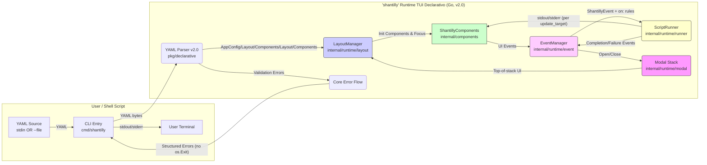
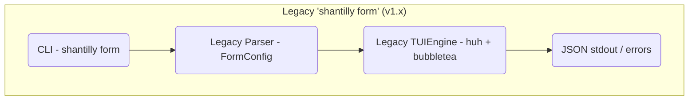

Sim, temos mais um artefato fundamental que serviu como guia para as decisões de desacoplamento (Layout vs. Lógica) e que contém o diagrama de fluxo atualizado: o **High Level Architecture (`docs/architecture/high-level-architecture.md`)**.

Este documento é essencial para entender a separação entre o `LayoutManager` (UI) e o `ScriptRunner`/`EventManager` (Automação).

Aqui está o conteúdo completo para a tua cópia local:

# High Level Architecture

## Technical Summary

The `shantilly` v2.0 architecture is a **Declarative, Event-Driven Runtime TUI**, implemented as a single static binary written in Go. It executes YAML-defined TUI applications, not just a single `form` subcommand.

Core principles (aligned with [`docs/architecture.md`](https://www.google.com/search?q=docs/architecture.md:1) and [`docs/prd.md`](https://www.google.com/search?q=docs/prd.md:1)):

  - The runtime loads a single YAML document that defines:
      - A hierarchical layout tree (`column`, `row`, `box`).
      - A set of TUI components (`form`, `list`, `viewport`, `buttongroup`, etc.).
      - An `on:` section that maps UI events to automation logic via `run:` actions.
  - The application is event-driven:
      - A central `LayoutManager` (root `bubbletea` model) manages ONLY layout, focus, resize handling, and integrates with Modal Stack structure - NO automation or script execution occurs in the LayoutManager, all automation flows through EventManager + on: handlers.
      - An `EventManager` translates `tea.Msg` / component outputs into normalized `ShantillyEvent` instances and dispatches them to `on:` handlers.
      - A `ScriptRunner` executes `run:` actions (initially `script:`), passing data via `args` and `stdin`, streaming outputs to `update_target` viewports, and enforcing lifecycle rules (including terminating previous processes for the same target).
  - Security is enforced via Just-In-Time (JIT) prompts:
      - Sensitive actions can require `confirm` and `prompt_secrets`, implemented as modal interactions managed on the same runtime stack.

The legacy v1.0 “monolithic CLI (form-only)” design is now encapsulated as `FormComponent` within this runtime, instead of being the architectural center.

## High Level Overview

Based on the Runtime TUI Declarativo PRD v2.0 and architecture v2.0:

1.  **Architectural Style:** Declarative Runtime TUI Engine.

      - Single static binary.
      - Consumes a YAML app definition and runs an event loop until the user or automation flow concludes.
      - No external network services or databases for Epic 1; integrations happen via executed scripts (`run:`).

2.  **Repository Structure:**

      - Go monorepo with clear separation:
          - `cmd/shantilly`: CLI entrypoint.
          - `pkg/declarative`: YAML models and parsing helpers.
          - `internal/runtime/layout`: `LayoutManager` and layout tree.
          - `internal/runtime/event`: `EventManager` and `ShantillyEvent`.
          - `internal/runtime/runner`: `ScriptRunner` and process lifecycle.
          - `internal/components`: concrete components (`FormComponent`, `ListComponent`, `ViewportComponent`, `ButtonGroupComponent`).
      - Legacy `internal/tui` form logic refatorado como parte de `FormComponent`.

3.  **Service Architecture:**

      - Monolithic binary acting as a local runtime.
      - No REST API / database in scope for Epic 1.
      - Future SSH serving via `wish` will wrap the same runtime loop (Epic 4).

4.  **Primary Data & Event Flow:**

      - `shantilly` is invoked (e.g. `shantilly --file app.yaml` or via stdin).
      - YAML is parsed into declarative models (`Config`, `LayoutNode`, `Component`, `RunAction`, etc.).
      - `LayoutManager` initializes the layout tree and components via AppConfig, manages layout/focus exclusively, and enters the `bubbletea` loop for pure UI management.
      - User and system interactions generate events:
          - Component events (`form:submit`, `list:select`, `buttongroup:press`, viewport scroll, etc.).
          - Modal results for confirm/secret prompts.
          - ScriptRunner outputs (stdout/stderr, exit codes).
      - `EventManager` maps events to `on:` handlers:
          - Executes `run:` actions using `ScriptRunner`.
          - Routes script output to `update_target` viewports.
      - For a given `update_target`, a new `run:` MUST terminate any previous associated process before starting another (SIGTERM-first, then SIGKILL if needed).
      - Runtime exits only when defined by the app flow (e.g. explicit “close/finish” events).

5.  **Dynamic YAML & Composition:**

      - The YAML describes the full dashboard/runtime behavior.
      - External scripts remain responsible for YAML templating if needed, but shantilly now supports multi-component, multi-step experiences within a single runtime, instead of forcing multiple process invocations.

## High Level Project Diagram (Runtime TUI Declarativo v2.0 — Ativo)

## Legacy Reference Diagram (v1.x — Não vinculante)

Este diagrama existe apenas como referência histórica para o trabalho de encapsulamento em `FormComponent` dentro do runtime declarativo v2.0. Ele não representa a arquitetura ativa e não pode ser usado como baseline de novas decisões.

## Architectural and Design Patterns

  - **Declarative Runtime:** YAML is the single source of truth for layout, components, and automation logic.
  - **The Elm Architecture (TEA):** `bubbletea` drives the event loop; all interactions modeled via `tea.Msg` and handled by the root model (`LayoutManager`) for layout/focus management ONLY, with EventManager handling all automation and business logic.
  - **Component Contract (`ShantillyComponent`):** All components implement a common interface (Init/Update/View/SetDimensions/ID), enabling:
      - Reusability.
      - Centralized layout and focus control.
      - Plug-and-play new components.
  - **Event Normalization (`ShantillyEvent`):** Unified event model used by `EventManager` to decouple component internals from business logic in `on:`.
  - **Runtime Script Execution (`ScriptRunner`):** Isolated runner responsible for:
      - `run.script` execution.
      - `args` and `stdin` binding.
      - Streaming outputs to `update_target` viewports.
      - Enforcing one-active-process-per-`update_target`.
  - **Modal Stack for JIT Security:**
      - Modals (confirmations, secret prompts) are modeled as components on a stack structurally integrated with `LayoutManager`, but with automation logic managed exclusively by EventManager and `on:` handlers.
      - Only the top modal receives focus/events.
      - Used to implement `confirm` and `prompt_secrets` without global, naive prompts.
  - **Modular Monolith:** Internally modularized by runtime engines and components, preserving a single deployable binary.