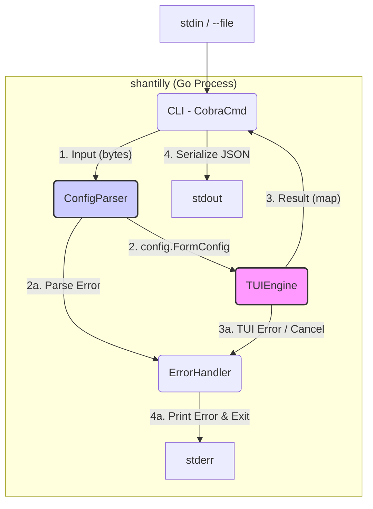
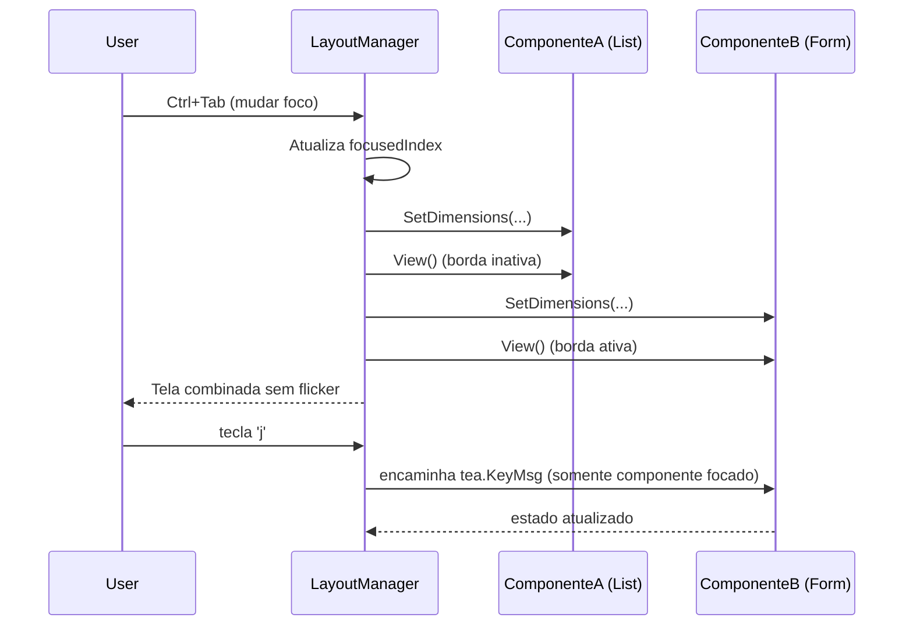
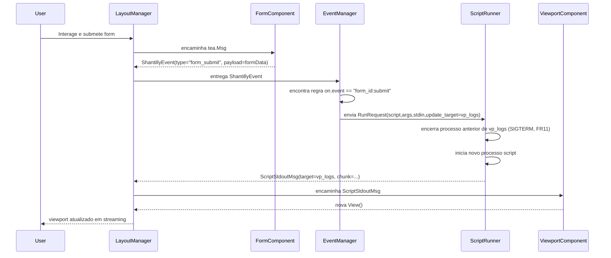
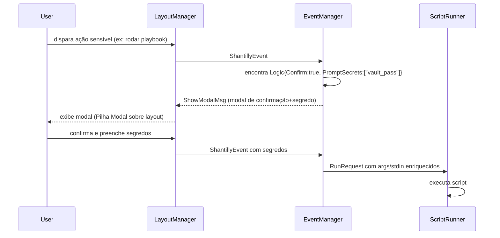

# Documento de Arquitetura Shantilly (v2.0)

## 1. Introdução

Este documento descreve a arquitetura geral do projeto Shantilly v2.0, focando no **Runtime TUI Declarativo (Épico 1)** .
 Ele serve como o plano arquitetônico orientador para o desenvolvimento
 orientado por IA, garantindo consistência e adesão aos padrões e
 tecnologias escolhidos.

### Fundação do Projeto (Refatoração do v1.0)

Esta arquitetura v2.0 não se baseia em um *template* inicial (starter) externo. Em vez disso, ela **absorve e refatora** o código validado do MVP v1.0 (analisado do repositório, ex: `internal/tui/model.go`, `internal/config/parser.go`), conforme definido no PRD v2.0 (Estória 1.4) . O código v1.0 existente (implementando `type: form` ) servirá como a fundação para o componente de formulário dentro do novo Runtime TUI.

### Change Log

| Data       | Versão | Descrição                                          | Autor               |
| ---------- | ------ | -------------------------------------------------- | ------------------- |
| 08/11/2025 | 2.0.0  | Rascunho inicial da arquitetura v2.0 (Runtime TUI) | Winston (Arquiteto) |

## 2. Arquitetura de Alto Nível

Esta seção estabelece a fundação da arquitetura v2.0 do Runtime TUI.

#### Resumo Técnico

A arquitetura do Shantilly v2.0 é um **Runtime TUI Declarativo orientado a eventos**. A aplicação consumirá um único arquivo YAML que define (1) um layout de UI complexo (usando `column`, `row`, `box` ), (2) os componentes TUI (`list`, `viewport`, `form` ) dentro desse layout, e (3) a lógica de automação (`on:`) que reage a eventos da UI. A arquitetura é baseada em Go, utilizando `bubbletea` para o ciclo de vida da UI, `lipgloss` para o motor de layout/estilo, e `huh` (refatorado do v1.0) para o componente de formulário.

#### Visão Geral de Alto Nível

1. **Estilo Arquitetural:** Runtime TUI Declarativo e Orientado a Eventos.

2. **Estrutura do Repositório:** Monorepo Go (conforme PRD v2.0 e validado no v1.0).

- **Fluxo de Dados Conceitual:**

  1. `shantilly` é executado com um YAML.

  2. O **Parser (YAML)** (Estória 1.1) lê a definição de `layout` e `on:`.

- O **Motor de Layout (Lipgloss)** (Estória 1.1) renderiza a UI (`column`/`row`/`box`) .

- Os **Componentes (Bubbles)** (ex: `list`, `form` ) (Estórias 1.3, 1.4) são inseridos no layout.

- O usuário interage (ex: envia um `form` ).

- O Componente emite uma `tea.Msg` padronizada (`shantillyEvent`).

- O **Motor de Eventos (on:)** (Estória 1.2) captura esta mensagem.

- O Motor de Eventos localiza um *handler* correspondente no YAML.

- O **Runner (Script)** (Estória 1.5) é executado, passando dados (via `args:` / `stdin:` ).

- O *stdout* do script é (opcionalmente) roteado para um `viewport` (FR11) .

#### Diagrama do Projeto de Alto Nível (Fluxo v2.0)

Snippet de código

```
graph TD
    subgraph Shantilly Runtime
        direction TB
        A[Arquivo YAML] --> B[Parser YAML];
        B --> C[Motor de Layout (lipgloss)];
        B --> D[Motor de Eventos (on:)];

        C -- Renderiza --> E[Componentes TUI (bubbles)];
        E -- Evento de UI (tea.Msg) --> D;

        D -- Dispara Ação --> F[Runner (script:)];
    end

    subgraph Usuário
        direction TB
        G[Usuário] <-->|Interage com| E;
    end

    subgraph Sistema Externo
        direction TB
        F -- (SIGTERM, args, stdin) --> H[Script.sh];
        H -- stdout/stderr --> F;
        F -- (Opcional) Atualiza --> E;
    end

    style A fill:#FFF,stroke:#333,stroke-width:2px
    style H fill:#EFEFEF,stroke:#333,stroke-width:2px
```

#### Padrões Arquiteturais e de Design

- **Padrão 1: UI Declarativa (Declarative UI):** A UI é definida por *dados* (YAML), não por código imperativo (FR1) .

- **Padrão 2: Orientado a Eventos (Event-Driven):** O `bubbletea` e o motor `on:` se comunicarão via mensagens (`tea.Msg`).

- **Refinamento A (Turno 5):** Usaremos um `struct` padronizado `shantillyEvent` para desacoplar componentes (como o `form` v1.0) do `EventManager` (Estória 1.2) .

- **Padrão 3: "Gestor Duplo" (Layout & Foco) (ToT, Turno 6):**

  - O `LayoutManager` (Estória 1.1) é um `bubbletea.Model` raiz único que gerencia *tanto* a **Renderização** (em `View`, para NFR2 "flicker-free" ) quanto o **Foco Global** (em `Update`, encaminhando teclas apenas para o filho ativo) (Meta de UI) .

- **Padrão 4: Padrão Adaptador (Wrapper) (Estória 1.4):**

  - O código `huh.Form` (v1.0) será "embrulhado" (wrapped) por um adaptador (Estória 1.4) que implementa a `ShantillyComponent` (Refinamento A) .

- Este adaptador irá *traduzir* eventos internos (ex: `huh.SubmitMsg`) para a `shantillyEvent` padronizada (ToT, Turno 7) .

## 3. Pilha de Tecnologias (Tech Stack)

A pilha a seguir é a referência única para o Runtime TUI Declarativo v2.0 (Épico 1). Todos os agentes (Dev/QA/SM/IA) devem considerá-la vinculante.

### 3.1. Build e Distribuição

- Build: GitHub Actions.
- Lint: `golangci-lint` (configurado em `.golangci.yml`).
- Build/Release: `GoReleaser` (configurado em `.goreleaser.yaml`).
- Saída: binários estáticos para Linux/macOS/Windows via GitHub Releases.

### 3.2. Stack de Runtime e TUI

| Categoria              | Tecnologia                    | Versão sugerida | Uso Arquitetural                                                                                      |
|------------------------|------------------------------|-----------------|--------------------------------------------------------------------------------------------------------|
| Linguagem              | Go                           | 1.24.2+         | Base do runtime, compilação estática.                                                                  |
| CLI Framework          | `spf13/cobra`                | 1.8.x+          | Organização de comandos/flags; entrada `stdin/--file`.                                                 |
| Motor TUI              | `charmbracelet/bubbletea`    | 0.26.x+         | Loop TEA; base para `LayoutManager`, `EventManager` e componentes.                                     |
| Layout/Estilo          | `charmbracelet/lipgloss`     | 0.10.x+         | Layout `column/row/box`, estilos e responsividade.                                                     |
| Formulários            | `charmbracelet/huh`          | 0.5.x+          | Base do `FormComponent` (wrapper v1.0 → v2.0).                                                         |
| Componentes TUI        | `charmbracelet/bubbles`      | 0.18.x+         | `list`, `viewport`, etc. para componentes declarativos.                                                |
| Markdown               | `charmbracelet/glamour`      | 0.7.x+          | Renderização de markdown em `viewport`.                                                               |
| YAML                   | `gopkg.in/yaml.v3`           | 3.x             | Parser para layout + lógica (`Config`, `LayoutNode`, `Component`, `Logic`).                           |
| Teste TUI              | `charmbracelet/teatest`      | 0.6.x+          | Testes de integração TUI automatizados (obrigatórios para layout/foco).                               |
| Teste Unitário         | `testing` (stdlib)           | -               | Cobertura de `config`, `runtime`, componentes.                                                         |
| Qualidade              | `golangci-lint`, `gofumpt`   | -               | Padrões de código e formatação obrigatórios.                                                           |

Decisões chave:

- Charmbracelet é a pilha oficial completa.
- `teatest` é obrigatório para validar NFR2 (layout fluido, foco) e mitigações de risco.
- Não há dependência de frameworks web ou bancos externos no Épico 1.

## 4. Modelos de Dados (Data Models)

Os modelos de dados v2.0 formalizam o YAML como a linguagem declarativa do Runtime TUI. Eles substituem o modelo linear `FormConfig` como fonte de verdade, incorporando layout, componentes e lógica de eventos.

A implementação concreta deve residir em [`pkg/declarative/models.go`](pkg/declarative/models.go:1) e ser usada pelo parser v2.0 e pelos motores `runtime/`.

### 4.1. Config (Raiz)

Representa o documento YAML completo.

Conceito (YAML):

- Raiz contém:
  - Nós de layout (`type: column|row|box`).
  - Bloco de lógica `on:` (lista de regras).

Contrato sugerido:

```go
// pkg/declarative/models.go

type Config struct {
    Root LayoutNode `yaml:",inline"`      // Layout raiz (column/row/box)
    On   []Logic    `yaml:"on,omitempty"` // Regras de eventos (FR8)
}
```

### 4.2. LayoutNode

Modela a árvore de layout hierárquica (FR1, FR2, FR3).

```go
type LayoutNode struct {
    Type   string       `yaml:"type"`             // "column" | "row" | "box"
    ID     string       `yaml:"id,omitempty"`     // ex: "sidebar", "content"
    Width  string       `yaml:"width,omitempty"`  // ex: "30%", "70%"
    Height int          `yaml:"height,omitempty"` // linhas fixas
    Flex   int          `yaml:"flex,omitempty"`   // proporção de espaço
    Items  []LayoutNode `yaml:"items,omitempty"`  // filhos para column/row
    // Para type: box
    Component *Component `yaml:"component,omitempty"`
}
```

Regras:

- `column/row` DEVEM usar `items`.
- `box` PODE conter exatamente um `component`.
- IDs devem ser únicos na árvore (para foco, eventos, update_target).

### 4.3. Component

Abstrai os componentes TUI declarativos (FR3–FR7).

```go
type Component struct {
    Type   string      `yaml:"type"`             // "list" | "viewport" | "buttongroup" | "form"
    ID     string      `yaml:"id,omitempty"`     // identificador lógico do componente
    Items  []Item      `yaml:"items,omitempty"`  // list / buttongroup
    Source *Source     `yaml:"source,omitempty"` // viewport
    // Form: payload bruto delegado para parser v1.0 (huh)
    Fields interface{} `yaml:"fields,omitempty"`
    Actions interface{} `yaml:"actions,omitempty"`
    // Conteúdo estático opcional
    Content string `yaml:"content,omitempty"`
}
```

Implementação recomendada:

- `Component` DEVE implementar `yaml.Unmarshaler` para:
  - Validar `Type`.
  - Delegar blocos `form` para o modelo v1.0 existente sem acoplamento rígido.
- Em runtime, cada `Component` será mapeado para uma implementação de `ShantillyComponent`.

### 4.4. Item

Itens para `list` e `buttongroup`.

```go
type Item struct {
    ID    string `yaml:"id"`
    Text  string `yaml:"text,omitempty"`  // list
    Label string `yaml:"label,omitempty"` // buttongroup
    Role  string `yaml:"role,omitempty"`  // ex: "primary", "danger"
}
```

### 4.5. Source (Viewport)

Define a origem do conteúdo do `viewport` (FR4).

```go
type Source struct {
    Type        string `yaml:"type"`                   // "static" | "command"
    Content     string `yaml:"content,omitempty"`      // texto/markdown estático
    Exec        string `yaml:"exec,omitempty"`         // comando a executar
    ContentType string `yaml:"content_type,omitempty"` // ex: "markdown"
}
```

### 4.6. Logic e RunAction (on:, FR8–FR11)

Modelam as regras de automação orientadas a eventos.

```go
type Logic struct {
    Event         string     `yaml:"event"`                    // ex: "user_form:submit"
    Run           RunAction  `yaml:"run"`                      // ação obrigatória
    Confirm       bool       `yaml:"confirm,omitempty"`        // segurança JIT: confirmar antes de executar
    PromptSecrets []string   `yaml:"prompt_secrets,omitempty"` // segurança JIT: nomes de segredos a coletar via modal
}

type RunAction struct {
    Script       string   `yaml:"script,omitempty"`         // FR9: runner genérico de script
    Args         []string `yaml:"args,omitempty"`           // FR10: templates ex: {{ form.username }}
    Stdin        string   `yaml:"stdin,omitempty"`          // FR10: template serializado em JSON
    UpdateTarget string   `yaml:"update_target,omitempty"`  // FR11: id do viewport a atualizar
}
```

Regras:

- `event` é obrigatório.
- `run.script` ou futuros runners especializados (ex: `ansible_playbook`) são obrigatórios.
- `update_target` ativa o ciclo de vida com SIGTERM do processo anterior.
- `confirm` e `prompt_secrets` são usados pelo mecanismo de pilha modal JIT (Segurança).

### 4.7. Eventos Internos

Além dos modelos YAML, o runtime define contratos internos para mensagens:

- `ShantillyEvent` (evento emitido por componentes).
- `RuntimeErrorMsg`, `ScriptStdoutMsg`, `ShowModalMsg`, etc.

Esses tipos residentes em [`pkg/tui/events.go`](pkg/tui/events.go:1) padronizam a comunicação entre:

- `LayoutManager`
- `EventManager`
- `ScriptRunner`
- Componentes TUI (via `ShantillyComponent`)

## 5. Componentes

Esta seção define como o Runtime TUI Declarativo é estruturado em motores centrais e componentes TUI, alinhado aos padrões `ShantillyComponent` e `shantillyEvent`.

### 5.1. Tema Central (Lipgloss)

Um tema único deve ser definido em [`internal/tui/theme.go`](internal/tui/theme.go:1) e utilizado por todos os componentes. Objetivos:

- Garantir consistência visual.
- Destacar foco, modais e estados de erro.
- Manter legibilidade em terminais escuros/claro.

(Regra: componentes não definem estilos arbitrários; consomem do tema central.)

### 5.2. Interface ShantillyComponent

Todos os componentes TUI concretos (incluindo wrappers) DEVEM implementar a interface definida em [`pkg/tui/interface.go`](pkg/tui/interface.go:1):

```go
type ShantillyComponent interface {
    Init() tea.Cmd
    Update(tea.Msg) (ShantillyComponent, tea.Cmd)
    View() string
    SetDimensions(width, height int)
    ID() string
}
```

Regras:

- `Update` não pode chamar `os.Exit`.
- Eventos de saída devem ser emitidos via `tea.Msg` padronizado (`ShantillyEvent`).

### 5.3. Eventos Internos (shantillyEvent)

Definidos em [`pkg/tui/events.go`](pkg/tui/events.go:1). Exemplos:

- `ShantillyEvent`:
  - `ComponentID`
  - `Type` (`"list_select"`, `"button_press"`, `"form_submit"`, `"script_output"`, `"runtime_error"`)
  - `Payload` (map/dados específicos)

Esses eventos conectam componentes → `EventManager` → `ScriptRunner` sem acoplamento direto.

### 5.4. Motores do Runtime

1) LayoutManager (`internal/runtime/layout/manager.go`)

- Responsável por:
  - Interpretar `LayoutNode`.
  - Instanciar componentes concretos (factory).
  - Gerenciar foco global (Ctrl+Tab, etc).
  - Multiplexar `tea.Msg` somente para o componente focado.
  - Aplicar NFR2: recalcular layout em `tea.WindowSizeMsg` (flicker-free).
  - Renderizar pilha modal (Arquitetura de Pilha Modal).

2) EventManager (`internal/runtime/event/manager.go`)

- Responsável por:
  - Receber `ShantillyEvent` dos componentes.
  - Correlacionar com entradas `on:` (lista `Logic`).
  - Aplicar regras JIT:
    - Se `Confirm == true`, emitir `ShowModalMsg` para confirmação.
    - Se `PromptSecrets` não vazio, emitir modal para coleta de segredos.
  - Enfileirar `RunRequest` em canal para o `ScriptRunner`.

3) ScriptRunner (`internal/runtime/runner/runner.go`)

- Responsável por:
  - Consumir `RunRequest` de um canal dedicado.
  - Executar `run.script` com:
    - `args` após template.
    - `stdin` após template (JSON).
  - Implementar FR11:
    - Se novo request com mesmo `update_target`: enviar SIGTERM ao anterior.
  - Emitir:
    - `ScriptStdoutMsg` (para update em `ViewportComponent` alvo).
    - `RuntimeErrorMsg` em caso de falhas.

### 5.5. Componentes TUI Concretos

1) FormComponent (Wrapper v1.0) (`internal/components/form/wrapper.go`)

- Embrulha o modelo v1.0 existente (`internal/tui/model.go`) para o contrato `ShantillyComponent`.
- Traduz:
  - Submit → `ShantillyEvent{Type:"form_submit", Payload: formData}`.

2) ListComponent (`internal/components/list/model.go`)

- Usa `bubbles/list`.
- Emite:
  - `ShantillyEvent{Type:"list_select", Payload:{id:itemID}}` ao selecionar item.

3) ButtonGroupComponent (`internal/components/buttongroup/model.go`)

- Rende botões lógicos (ex: roles `primary`, `danger`).
- Emite:
  - `ShantillyEvent{Type:"button_press", Payload:{id:buttonID}}`.

4) ViewportComponent (`internal/components/viewport/model.go`)

- Usa `bubbles/viewport` + `glamour`.
- Suporta:
  - `source: static+markdown`.
  - `source: command` via integração com `ScriptRunner`.
- Implementa:
  - Buffer circular para saída longa.
  - Atualização incremental em resposta a `ScriptStdoutMsg`.

### 5.6. CLI / Borda

CLI (`cmd/shantilly/main.go`):

- Lê YAML (`stdin`/`--file`).
- Usa parser v2.0 (`pkg/declarative`) para `Config`.
- Inicializa `LayoutManager`/runtime.
- Trata erros de inicialização via `ErrorHandler`.

### Component Diagram (Internal Control Flow)



## 6. APIs Externas

N/A para o Épico 1. O runtime:

- Não realiza chamadas HTTP diretas.
- Não expõe API REST.
- Interage apenas com:
  - stdin/stdout/stderr.
  - Processos locais iniciados via `run.script` (scripts do usuário).

Qualquer integração externa acontece dentro do script do usuário e é responsabilidade dele.

---

## 7. Workflows Principais (Core Workflows)

Os workflows abaixo descrevem o comportamento esperado do Runtime TUI Declarativo, incluindo foco, eventos, execução de scripts e segurança JIT.

### 7.1. Workflow: Renderização e Foco Global (LayoutManager)

Objetivo: garantir NFR2 (layout fluido, flicker-free) e foco consistente.



Regras:

- Somente o componente focado recebe teclas de navegação/edição.
- `tea.WindowSizeMsg`:
  - Recalcula dimensões.
  - Nunca causa piscadas excessivas (uso de lipgloss e recomputação estável).

### 7.2. Workflow: Submissão de Formulário → on: → ScriptRunner → Viewport (FR7–FR11)



### 7.3. Workflow: Segurança JIT com Pilha Modal (confirm/prompt_secrets)



Regras:

- Sem confirmação → ação não é executada.
- Segredos são coletados somente JIT e não persistidos.

## 8. APIs Externas

N/A no escopo do Runtime TUI v2.0 (Épico 1):

- Nenhuma REST API exposta.
- Nenhuma dependência HTTP obrigatória.
- Scripts chamados via `run.script` podem falar com o mundo externo, mas isso é responsabilidade do usuário.

---

## 9. Esquema de Banco de Dados

N/A:

- Sem armazenamento persistente.
- Todo estado é em memória no processo Bubble Tea.
- Dados fluem:
  - YAML (entrada) → runtime → scripts → stdout/viewport (visual).
- Futuras extensões (ex: cache local) exigiriam atualização deste documento.

---

## 10. Árvore de Código-Fonte (Source Tree)

A árvore abaixo reflete a arquitetura v2.0 proposta (alguns diretórios são metas para implementação futura, guiando os agentes de desenvolvimento).

```plaintext
shantilly/
├── cmd/
│   └── shantilly/
│       └── main.go                # CLI: lê YAML, inicializa runtime
├── pkg/
│   ├── declarative/
│   │   └── models.go              # Config, LayoutNode, Component, Logic, RunAction
│   └── tui/
│       ├── interface.go           # ShantillyComponent
│       └── events.go              # ShantillyEvent, RuntimeErrorMsg, etc.
├── internal/
│   ├── runtime/
│   │   ├── layout/
│   │   │   └── manager.go         # LayoutManager (Gestor Duplo + Pilha Modal)
│   │   ├── event/
│   │   │   └── manager.go         # EventManager (on: → RunRequest)
│   │   └── runner/
│   │       ├── runner.go          # ScriptRunner (FR9–FR11, SIGTERM/UpdateTarget)
│   │       └── templating.go      # Motor de templates (args/stdin)
│   ├── components/
│   │   ├── form/
│   │   │   ├── wrapper.go         # Wrapper v1.0 → ShantillyComponent
│   │   │   └── model_v1.go        # Código legado v1.0 isolado
│   │   ├── list/
│   │   │   └── model.go           # ListComponent (bubbles/list)
│   │   ├── viewport/
│   │   │   └── model.go           # ViewportComponent (bubbles/viewport + glamour)
│   │   └── buttongroup/
│   │       └── model.go           # ButtonGroupComponent
│   ├── config/
│   │   ├── parser.go              # Parser atual (pode ser adaptado p/ v2.0)
│   │   └── validation.go          # Regras adicionais de validação
│   └── util/
│       └── errorhandler.go        # Tratamento de erros centralizado v1.0 (para CLI)
├── docs/
│   └── architecture.md            # Este documento
├── examples/
│   └── *.yaml                     # YAMLs exemplo v2.0 (layout+on)
└── scripts/
    └── *.sh                       # Utilidades, smoke-tests
```

Esta árvore é a referência para implementação progressiva pelo Scrum Master e pelos agentes Dev.

## Infrastructure and Deployment

### Infrastructure as Code (IaC)

- **Tool:** `GoReleaser` (`.goreleaser.yaml` from template).
- **Location:** `.goreleaser.yaml` (root directory).
- **Approach:** Defines declarative build, cross-compilation, packaging, and release process.

### Deployment Strategy (Release)

- **Strategy:** GitHub Releases.
- **CI/CD Platform:** GitHub Actions (Tech Stack).
- **Pipeline Configuration:** `.github/workflows/release.yml`.

### Environments

- **N/A:** Not applicable for a CLI. Target environments are user machines (Linux, macOS, Windows - NFR2).

### Promotion Flow (Release)

```mermaid
graph TD
    A[Dev: Push to 'main'] --> B(CI: Run 'golangci-lint' & 'go test')
    B -- Success --> C[Dev: Create Git Tag (e.g., 'v1.0.0')]
    C --> D[Dev: Push Tag to GitHub]
    D -- Trigger (on tag) --> E[GitHub Actions: Run 'goreleaser release']

    subgraph "GoReleaser (in CI)"
        direction TB
        F(1. Static Compile<br/>CGO_ENABLED=0)
        F --> G(2. Cross-Compile<br/>NFR2 Targets)
        G --> H(3. Create Checksums)
        H --> I(4. Package Archives<br/>.zip / .tar.gz)
    end

    E --> F
    I --> J[GitHub Actions: Publish GitHub Release 'v1.0.0' with binaries]

    style J fill:#bbf,stroke:#333,stroke-width:2px
```

### Rollback Strategy

- **Method:** Delete problematic GitHub Release, publish new patch release (e.g., `v1.0.1`) with fix.
- **Triggers:** Critical bug reports from users.

## Error Handling Strategy

### General Approach

- **Model:** Standard Go `error` interface.
- **Propagation:** Errors propagated up the call stack to `CLI`.
- **Centralized Handling:** `CLI` catches errors, passes to `ErrorHandler`.
- **Output Separation:** `stdout` for success JSON (FR6), `stderr` for errors/status (NFR8).
- **Exit Codes:** Non-zero exit codes for errors and cancellations defined in `internal/util`.

### Error Handling Patterns

**YAML Parse Errors (`ConfigParser`)**

- **Detection:** `gopkg.in/yaml.v3` errors.
- **Output:** Formatted message (incl. line number if possible) to `stderr`.
- **Exit Code:** `util.ExitError` (e.g., 1).
- **Workflow:** See "Workflow 2: YAML Parse Error".

**TUI Cancellation (`TUIEngine`)**

- **Detection:** `bubbletea.QuitMsg` or specific `util.ErrAborted`.
- **Output:** No `stdout`. Optional "Cancelled" message to `stderr`.
- **Exit Code:** `util.ExitCancelled` (e.g., 2).
- **Workflow:** See "Workflow 3: User Cancellation".

**Unexpected TUI Errors (`TUIEngine`)**

- **Detection:** Internal `bubbletea`/`huh` errors.
- **Output:** Detailed error message (maybe stack trace) to `stderr`.
- **Exit Code:** `util.ExitError` (e.g., 1).

**Other Errors (e.g., JSON Encoding)**

- **Detection:** Standard library errors.
- **Output:** Error message to `stderr`.
- **Exit Code:** `util.ExitError` (e.g., 1).

### Implementation (`ErrorHandler`)

Located in `internal/util/errorhandler.go`. Provides `Handle(err error)`.

```go
package util

import (
 "errors" // Import errors package
 "fmt"
 "os"

 tea "[github.com/charmbracelet/bubbletea](https://github.com/charmbracelet/bubbletea)" // Import bubbletea
)

// Exit codes for clarity
const (
 ExitOK        = 0
 ExitError     = 1 // General error
 ExitCancelled = 2 // User cancellation
)

// Define a specific error for cancellation if bubbletea.QuitMsg isn't enough context
var ErrAborted = errors.New("operation aborted by user")

// Handle prints the error (if not nil) to stderr and exits with the code.
// It assumes successful exit (code 0) if err is nil.
func Handle(err error) {
 if err == nil {
  os.Exit(ExitOK) // Success path
 }

 exitCode := ExitError // Default to general error

 // Check for specific error types or messages
 // Check if it's our specific abort error OR if it's the standard bubbletea Quit message
 if errors.Is(err, ErrAborted) || errors.As(err, &tea.QuitMsg{}) {
  exitCode = ExitCancelled
  // Optionally print a message to stderr for cancellation
  // fmt.Fprintln(os.Stderr, "Operation cancelled.") // Keep it silent for better script integration
 } else {
  // Print actual error for non-cancellation cases
  fmt.Fprintf(os.Stderr, "Error: %v\n", err)
  // TODO: Add more sophisticated error type checking and formatting here
  // e.g., check for YAML parsing errors and provide line numbers if possible from yaml.v3.
 }

 os.Exit(exitCode)
}
```

## Coding Standards

Defined primarily by the user-provided template files. Adherence is mandatory and checked automatically.

### Core Standards

- **Language & Runtime:** Go `1.24.2+` (per template `go.mod`).
- **Style & Linting:** Governed by `.golangci.yml` (per template). Checked via `golangci-lint run ./...` and pre-commit hooks.
- **Formatting:** Governed by `gofumpt`. Checked via `gofumpt -w .` and pre-commit hooks.
- **Test Organization:** `_test.go` files in the same package (Go standard).

### Naming Conventions

- Standard Go conventions (`camelCase`, `PascalCase`). Enforced by `stylecheck` linter in `.golangci.yml`.

### Critical Rules (from `.golangci.yml`)

1. **Error Handling (`errcheck`, `errorlint`, `wrapcheck`):** Check/wrap all errors. Use `errors.Is/As`.
2. **No Unused Code (`unused`, `ineffassign`):** Remove dead code.
3. **Simplicity (`gocyclo`, `funlen`, `nestif`):** Keep functions short, low complexity.
4. **Performance (`prealloc`, `gocritic`):** Pre-allocate slices, follow `gocritic` advice.
5. **No Magic Numbers (`mnd`):** Use named constants.
6. **Full Struct Init (`exhaustivestruct`):** Initialize all struct fields explicitly.

### TUI-Specific Guidelines (Bubble Tea + Charm)

**Preventing TUI Rendering Failures:**

1. **Window Size Handling (`tea.WindowSizeMsg`):**
   - **Mandatory:** Always handle `tea.WindowSizeMsg` in the `Update` function to ensure responsive behavior.
   - **Pattern:** Update model dimensions and trigger re-renders when terminal size changes.
   - **Testing:** Use `teatest.WithInitialTermSize` in integration tests to validate different terminal dimensions.

2. **Layout Primitives (`lipgloss`):**
   - **Strong Recommendation:** Use `lipgloss` primitives (`Width`, `Height`, `JoinHorizontal`, `JoinVertical`) for layout management.
   - **Purpose:** Ensures consistent spacing, alignment, and responsive behavior across different terminal sizes.
   - **Pattern:** Define layout constraints explicitly rather than relying on hardcoded spacing.

3. **Responsive Components:**
   - **Terminal Width Awareness:** Always consider terminal width constraints when designing TUI layouts.
   - **Truncation Strategy:** Implement text truncation or responsive components (`bubbles/list`, `bubbles/viewport`) for content that may exceed terminal width.
   - **Component Selection:** Prefer existing `bubbles` components over custom implementations for complex UI patterns.

4. **Centralized Styling:**
   - **Theme Definition:** Define a centralized `lipgloss` theme to ensure consistent styling across all TUI components.
   - **Consistency:** Apply theme styles uniformly to maintain visual coherence and prevent styling-related rendering issues.

### Language-Specific Guidelines (Go)

- Follow "Effective Go".
- Use pointers judiciously.
- Prefer small interfaces.

## Test Strategy and Standards

### Testing Philosophy

- **Approach:** Test-After for MVP. Focus on unit tests first, with integration tests for TUI components using `teatest`.
- **Coverage Goals:** No strict % target for MVP, but high coverage (\>80%) for `internal/config` and critical TUI flows.
- **Test Pyramid (MVP):** Heavy on Unit Tests, complemented by TUI Integration Tests using `teatest`, and Manual TUI tests.

### Test Types and Organization

**Unit Tests**

- **Framework:** Go `testing` package (v1.24.2+).
- **File Convention:** `_test.go` in the same package.
- **Location:** Primarily `internal/config/` and `internal/tui/`.
- **Mocking:** No external dependencies to mock in MVP. Use interfaces for potential future manual fakes/stubs if needed between internal components.
- **AI Agent Requirements:** Generate comprehensive tests for `internal/config/parser.go`, covering valid/invalid YAML cases. Follow AAA pattern. Maintain pure unit tests for `Update` logic in TUI components.

**TUI Integration Tests (teatest)**

- **Framework:** `charmbracelet/bubbles/teatest` for testing Bubble Tea components.
- **Purpose:** Validate critical user flows and assert on textual output (string output), including basic layout and presence of styled elements via `lipgloss`.
- **Key Features:**
  - Use `teatest.WithInitialTermSize` to run tests with different terminal sizes for responsive behavior validation.
  - Focus on testing complete TUI workflows rather than individual component rendering.
  - Assert on final rendered output strings to verify layout and styling.
- **Location:** `internal/tui/` alongside unit tests.
- **AI Agent Requirements:** Create integration tests for critical TUI flows using `teatest`, ensuring proper handling of `tea.WindowSizeMsg` and responsive layout across different terminal dimensions.

**Integration Tests**

- **N/A:** Out of scope for MVP.

**E2E Tests**

- **N/A:** Out of scope for MVP. Manual testing covers this.

### Test Data Management

- **Strategy:** Example `.yaml` files in `examples/` directory act as fixtures for `ConfigParser` tests.

### Continuous Testing

- **CI Integration:** GitHub Actions runs `go test ./...` (via `lint.sh` or build workflow).
- **Local Testing:** Developers use `./lint.sh` (from template) which includes `go test -v -race ./...`.
- **Performance/Security Tests:** N/A for MVP.

## Security

### Input Validation

- **Focus:** YAML input via `stdin` or `--file`.
- **Location:** `ConfigParser` (`internal/config/parser.go`).
- **Required Rules:**
  - Validate `Field.Type` against known `huh` component types (e.g., "input", "textarea", "select", "multiselect", "confirm", "note"). Reject invalid types via `ErrorHandler` (NFR8).
  - Handle malformed YAML gracefully via `ErrorHandler` (NFR8).

### AuthN / AuthZ / Secrets / API Security / Data Protection

- **N/A:** Not applicable for MVP (local CLI, no network, no sensitive data persistence).

### Dependency Security

- **Scanning Tool:** `govulncheck`.
- **Update Policy:** Review/update dependencies regularly (e.g., via Dependabot).
- **Approval Process:** Evaluate new dependencies before adding.

### Security Testing

- **SAST:** `gosec` (integrated via `golangci-lint` in `.golangci.yml`).
- **DAST / Pentest:** N/A for MVP.

## Checklist Results Report

**Architect Solution Validation Checklist (`architect-checklist.md`) Execution Summary**

- **Project Type:** Greenfield CLI/TUI (Backend Only focus for checklist)
- **Overall Architecture Readiness:** High
- **Critical Risks Identified:** 0
- **Key Strengths:** Clear alignment with PRD, leveraging standard Go practices and user-provided template, well-defined error handling, robust build/release process via GoReleaser.
- **Sections Evaluated:** All sections except those marked `[[FRONTEND ONLY]]`.

**Section Analysis (Summary)**

| Section                                | Status | Notes                                                                |
|:---------------------------------------|:-------|:---------------------------------------------------------------------|
| 1. Requirements Alignment              | ✅ PASS | Architecture directly maps to PRD requirements (FR/NFR).             |
| 2. Architecture Fundamentals           | ✅ PASS | Clear diagrams, modular internal design, standard patterns used.     |
| 3. Technical Stack & Decisions         | ✅ PASS | Stack defined, versions specified, aligned with user template.       |
| 4. Frontend Design (Skipped)           | N/A    | Project is CLI/TUI only.                                             |
| 5. Resilience & Operational            | ✅ PASS | Error handling defined, deployment via GoReleaser is robust.         |
| 6. Security & Compliance               | ✅ PASS | Minimal surface area addressed (input validation, dep scanning).     |
| 7. Implementation Guidance             | ✅ PASS | Coding standards via `.golangci.yml`, Source Tree defined.           |
| 8. Dependency & Integration Mgmt       | ✅ PASS | Dependencies managed via `go.mod`, no external runtime integrations. |
| 9. AI Agent Implementation Suitability | ✅ PASS | Modular design, clear standards, template use aids AI consistency.   |
| 10. Accessibility (Skipped)            | N/A    | TUI accessibility handled by underlying libraries (Charm).           |

**Risk Assessment**

- No critical risks identified in the architecture itself.
- Potential implementation risks (low):
  - Complexity in `TUIEngine` mapping `config.FormConfig` to `huh.Form` dynamically. Mitigation: Clear `mapper.go` component, unit tests for edge cases if possible.
  - Ensuring correct error propagation and exit codes for all scenarios in `ErrorHandler`. Mitigation: Specific unit tests for `ErrorHandler`, manual testing of error paths.

**Recommendations**

- **Must-fix:** None.
- **Should-fix:** None identified at architecture level.
- **Nice-to-have:** Consider adding specific examples in `examples/` for each supported `Field.Type`.

**AI Implementation Readiness**

- **High.** The architecture is modular, uses standard Go patterns, relies on template files for tooling setup (`.golangci.yml`, `.goreleaser.yaml`), and provides clear separation of concerns. The `README.md` from the template gives direct instructions to AI agents.

**Final Verdict:** The architecture is sound, complete for the MVP scope, well-aligned with the PRD and user-provided template, and ready for development.

## Next Steps

### Handoff Prompt for Developer Agent

**To:** Dev Agent 👨‍💻
**From:** Winston (Architect) 🏗️
**Subject:** Implement Shantilly MVP - Story 1.1 (CLI Foundation)

**Context:**
The architecture for the `shantilly` CLI (MVP) is finalized and validated (see `docs/architecture.md`). This project uses Go (1.24.2+) and the Charmbracelet ecosystem (`bubbletea`, `huh`, `lipgloss`) along with `cobra` and `yaml.v3`. We are adopting the user-provided project template files (`.golangci.yml`, `.goreleaser.yaml`, `go.mod`, etc.) for tooling and standards.

**Goal:**
Implement Story 1.1 from the PRD (`prd.md`) - "CLI Foundation and Project Structure".

**Key Architectural Guidance (from `docs/architecture.md`):**

- **Source Tree:** Follow the defined structure, place main logic in `cmd/shantilly/main.go`.
- **Tech Stack:** Use `spf13/cobra` (v1.8.x).
- **Components:** Implement the basic `CLI (CobraCmd)` component.
- **Coding Standards:** Adhere strictly to `.golangci.yml` rules. Use `gofumpt` for formatting. Ensure `./lint.sh` passes before marking complete.

**Tasks (derived from Story 1.1 ACs):**

1. Initialize the Go module structure as defined in the `Source Tree` section (if not already present from the template). Ensure `go.mod` reflects the project name and Go version.
2. Implement the root `shantilly` command using `spf13/cobra` in `cmd/shantilly/main.go`.
3. Add the `form` subcommand to the root command (also in `main.go`). Define the `--file` string flag for it.
4. Implement the `RunE` (or `Run`) function for the `form` subcommand:
      - Check if the `--file` flag was provided.
          - If yes, read the content of the specified file. Handle file read errors.
          - If no, read all bytes from `os.Stdin`. Handle potential stdin read errors.
      - Propagate any read errors up to be handled by the `ErrorHandler`.
      - *(For this story only)*: Print a placeholder message like "Form executed. Read X bytes." to `os.Stdout`.
      - Return `nil` on success.
5. Ensure the `ErrorHandler` (`internal/util/errorhandler.go`) is implemented as defined in the architecture doc (handling `nil` error, printing non-nil errors to `stderr`, using `os.Exit` with defined codes). Update `main.go`'s `RunE` to call `util.Handle(err)` appropriately on error return.
6. Create/Update the `Makefile` with a basic `build` target: `go build -o shantilly ./cmd/shantilly`. Add `lint` (`./lint.sh`) and `test` (`go test -v -race ./...`) targets.
7. Ensure the code passes `make lint` and `make test` (though no specific tests for this story yet).

**Acceptance Criteria (from Story 1.1):**

- [AC1] Go repo initialized (`cmd/`, `internal/`).
- [AC2] `spf13/cobra` used.
- [AC3] `shantilly` root and `form` subcommand exist.
- [AC4] `shantilly form` reads `stdin` OR uses `--file` flag.
- [AC5] `shantilly form` prints placeholder to `stdout` on success.
- [AC6] `Makefile` includes `build`, `lint`, `test` targets.
- (Implicit) Errors during input reading lead to `stderr` message and non-zero exit code via `ErrorHandler`.

**Definition of Done:**

- All tasks completed.
- All ACs met.
- Code is formatted (`gofumpt`).
- Linter passes (`make lint`).
- Build succeeds (`make build`).
- Provide the complete content for `cmd/shantilly/main.go` and `internal/util/errorhandler.go`. List any other created/modified files (like `Makefile`).
