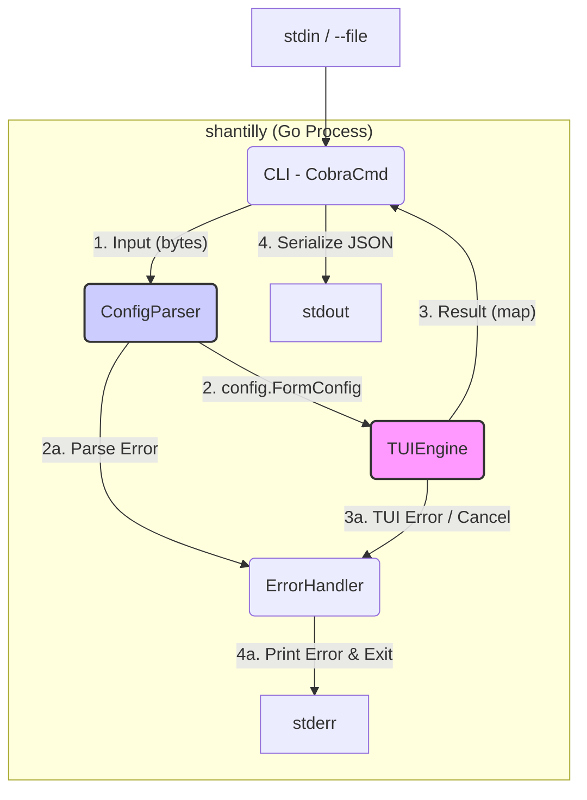

# Components

## Frontend Architecture (TUI)

### Centralized Styling Theme

**Lipgloss Theme Definition:**

To ensure consistent styling across all TUI components and prevent styling-related rendering issues, define a centralized theme using `lipgloss`:

```go
// Location: internal/tui/theme.go

package tui

import "github.com/charmbracelet/lipgloss"

// Theme defines the centralized styling for all TUI components
type Theme struct {
    // Base styles
    Base lipgloss.Style

    // Form-specific styles
    FormTitle lipgloss.Style
    FieldLabel lipgloss.Style
    FieldInput lipgloss.Style
    FieldError lipgloss.Style

    // Layout styles
    Container lipgloss.Style
    Border lipgloss.Style
}

// NewTheme creates a new theme with consistent styling
func NewTheme() Theme {
    return Theme{
        Base: lipgloss.NewStyle().
            Padding(1, 2),

        FormTitle: lipgloss.NewStyle().
            Bold(true).
            Foreground(lipgloss.Color("#FAFAFA")).
            Background(lipgloss.Color("#7D56F4")).
            Padding(0, 1),

        FieldLabel: lipgloss.NewStyle().
            Bold(true).
            Foreground(lipgloss.Color("#FAFAFA")),

        FieldInput: lipgloss.NewStyle().
            Border(lipgloss.RoundedBorder()).
            BorderForeground(lipgloss.Color("#7D56F4")).
            Padding(0, 1),

        FieldError: lipgloss.NewStyle().
            Foreground(lipgloss.Color("#FF0000")).
            Italic(true),

        Container: lipgloss.NewStyle().
            Border(lipgloss.RoundedBorder()).
            BorderForeground(lipgloss.Color("#7D56F4")).
            Padding(1, 2),

        Border: lipgloss.NewStyle().
            Border(lipgloss.RoundedBorder()).
            BorderForeground(lipgloss.Color("#7D56F4")),
    }
}
```

**Usage Guidelines:**

* **Mandatory Application:** All TUI components must use styles from the centralized theme.
* **Consistency:** Apply theme styles uniformly across all form fields and layout elements.
* **Responsive Design:** Theme styles should work across different terminal sizes (validated via `teatest`).
* **Maintenance:** Update theme definitions in one place to maintain visual coherence.

## Component List

**`CLI (CobraCmd)`**

* **Responsibility:** Entry point (`cmd/shantilly/main.go`). Manages `form` command (`spf13/cobra`), reads input (stdin/file), invokes `ConfigParser` and `TUIEngine`, directs results/errors to `stdout`/`stderr`.
* **Key Interfaces:** `formCmd.RunE(cmd *cobra.Command, args []string) error`
* **Dependencies:** `ConfigParser`, `TUIEngine`, `ErrorHandler`.
* **Technology:** `spf13/cobra`.

**`ConfigParser`**

* **Responsibility:** (`internal/config`). Decodes input YAML into `config.FormConfig` structs. Performs initial validation (e.g., known `Type`).
* **Key Interfaces:** `func Parse(data []byte) (*config.FormConfig, error)`
* **Dependencies:** `gopkg.in/yaml.v3`, `config.FormConfig`.
* **Technology:** `gopkg.in/yaml.v3`.

**`TUIEngine`**

* **Responsibility:** (`internal/tui`). Core interactive component. Receives `config.FormConfig`. Dynamically builds `huh.Form` by mapping `FieldConfig` to `huh` components. Wraps the form in a `bubbletea.Model` to manage TUI state and lifecycle.
* **Key Interfaces:** `func Run(config *config.FormConfig) (map[string]interface{}, error)`
* **Dependencies:** `bubbletea`, `huh`, `lipgloss`, `config.FormConfig`.
* **Technology:** `charmbracelet/bubbletea`, `charmbracelet/huh`, `charmbracelet/lipgloss`.

**`ErrorHandler`**

* **Responsibility:** Utility (`internal/util`). Centralizes error handling (NFR8). Formats errors, writes to `stderr`, exits with non-zero status.
* **Key Interfaces:** `func Handle(err error)` (Updated based on implementation example).
* **Dependencies:** `os`, `fmt`, `errors`, `bubbletea`.
* **Technology:** Go Standard Library, `bubbletea`.

## Component Diagram (Internal Control Flow)


