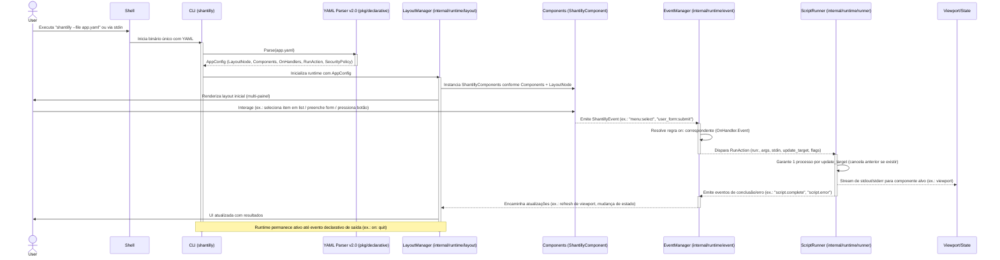
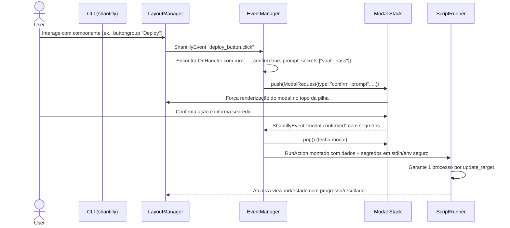
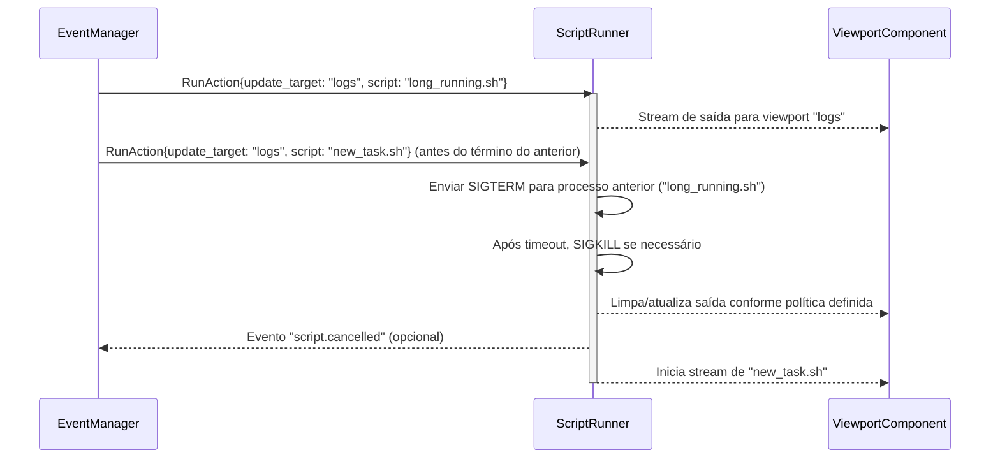
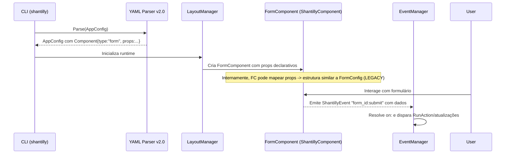

# Core Workflows

Este documento descreve os fluxos centrais do Runtime TUI Declarativo v2.0, alinhados ao contrato YAML único e aos blocos:

- E1.1 — LayoutManager
- E1.2 — Component Model + FormComponent legado encapsulado
- E1.3 — EventManager + ShantillyEvent + on:
- E1.4 — ScriptRunner
- E1.5 — Modal Stack + Security

Fontes normativas:

- PRD: [`docs/prd/epic-1-runtime-tui-foundation.md`](docs/prd/epic-1-runtime-tui-foundation.md:1)
- Arquitetura: [`docs/architecture/introduction.md`](docs/architecture/introduction.md:1), [`docs/architecture/high-level-architecture.md`](docs/architecture/high-level-architecture.md:1), [`docs/architecture/data-models.md`](docs/architecture/data-models.md:1), [`docs/architecture/components.md`](docs/architecture/components.md:1)
- Story Map: [`docs/stories/index-epic-1-runtime-tui.story-map.md`](docs/stories/index-epic-1-runtime-tui.story-map.md:1)
- Implementation Plan: [`docs/architecture/implementation-plan-epic-1-runtime-tui.md`](docs/architecture/implementation-plan-epic-1-runtime-tui.md:1)
- QA Matrix: [`docs/qa/matrix-epic-1-runtime-tui-coverage.md`](docs/qa/matrix-epic-1-runtime-tui-coverage.md:1)

Qualquer fluxo baseado em `shantilly form`/`FormConfig` é considerado Legacy e descrito apenas em seção específica ao final.

---

## Workflow 1 — Execução Declarativa Completa (Happy Path) — E1.1–E1.4

Objetivo: ilustrar o caminho padrão do runtime v2.0, do YAML único até a execução de scripts e atualização da UI.



Rastreabilidade:

- E1.1 — construção de layout.
- E1.2 — uso de ShantillyComponent.
- E1.3 — roteamento via EventManager/on:.
- E1.4 — ScriptRunner com update_target.
- QA Matrix: linhas de fluxo end-to-end.

---

## Workflow 2 — Validação do YAML e Segurança de Contrato — E1.1, E1.3, E1.5 (Wave 7)

Objetivo: garantir que apenas YAML válido e aderente ao contrato seja aceito (schema + deny by default + anti-Trojan YAML).

```mermaid
sequenceDiagram
    actor User
    participant Shell
    participant CLI as CLI (shantilly)
    participant Parser as YAML Parser v2.0
    participant SEC as Security/Validation Layer

    User->>Shell: Executa "shantilly --file app.yaml"
    Shell->>CLI: Inicia binário

    activate CLI
    CLI->>Parser: Parse(app.yaml)
    activate Parser
    Parser->>SEC: Validar estrutura (AppConfig, LayoutNode, Components, on:, run:, SecurityPolicy)
    activate SEC
    SEC-->>Parser: Resultado da validação (ok | erro)
    deactivate SEC

    alt YAML inválido ou chaves desconhecidas / ações não permitidas
        Parser-->>CLI: erro estruturado (ex.: ValidationError)
        deactivate Parser
        CLI-->>Shell: escreve erro em stderr, encerra com código apropriado
    else YAML válido
        Parser-->>CLI: AppConfig válido
        deactivate Parser
        CLI->>LM: segue Workflow 1
    end
    deactivate CLI
```

Regras normativas (deny-by-default + Anti-Trojan YAML):

- AppConfig é o contrato único:
  - Nenhum arquivo/config paralelo pode redefinir `layout`, `components`, `on:`, `run:`, `security`.
- Chaves desconhecidas ou ações fora do modelo:
  - Devem ser rejeitadas de forma bloqueante (deny by default efetivo).
- Execuções automáticas não interativas não são permitidas:
  - `run:` nunca é disparado no parse/carga.
  - Fluxo sempre parte de `ShantillyEvent` de UI resolvido via `OnHandler`.
- Integração com SecurityPolicy:
  - Whitelist de tipos/ações/paths orienta o ScriptRunner.
  - Violações geram erro estruturado, nunca execução silenciosa.
- Encadeamento:
  - Parser/validator (`pkg/declarative`) aplica estas regras antes de qualquer inicialização do runtime.

Rastreabilidade:

- E1.1/E1.5.
- QA Matrix: linhas de validação e anti-Trojan.

---

## Workflow 3 — Segurança JIT com Modal Stack (confirm / prompt_secrets) — E1.3, E1.4, E1.5

Objetivo: ilustrar como ações sensíveis exigem confirmação e coleta de segredos via modais antes da execução.



Regras normativas:

- Enquanto houver modal ativo:
  - Apenas o topo recebe eventos.
- Segredos:
  - Não persistidos em disco.
  - Não exibidos em logs.
- Ações marcadas como sensíveis:
  - Nunca executadas sem confirmação explícita do usuário (Trojan YAML mitigado).

Rastreabilidade:

- E1.3–E1.5.
- QA Matrix: Modal Stack + Security.

---

## Workflow 4 — Cancelamento de Execução e Regra 1 Processo por update_target — E1.4

Objetivo: garantir controle determinístico sobre processos associados a um `update_target`.



Regras normativas:

- Nunca dois processos concorrentes para o mesmo `update_target`.
- Comportamento deve ser coberto por testes de integração/segurança.

Rastreabilidade:

- E1.4.
- QA Matrix: regra 1 processo/update_target.

---

## Workflow 5 — Encapsulamento do Legado como FormComponent — E1.2 + Legacy

Objetivo: mostrar como o v1.x é consumido APENAS como backend do `FormComponent`.



Regras:

- Toda entrada/saída relevante passa pelo contrato v2.0 (AppConfig, Components, ShantillyEvent, on:, run:).
- `FormConfig` e `TUIEngine` antigos:
  - Não são expostos como API.
  - Não definem mais fluxos canônicos.

Rastreabilidade:

- E1.2 + Confinamento do legado.
- QA Matrix: linha específica de encapsulamento.

---

## Seção Legacy (não vinculante) — Fluxo v1.x (apenas referência histórica)

Esta seção registra de forma resumida o fluxo antigo `shantilly form` para auxiliar na migração do código, sem qualquer força normativa sobre a arquitetura v2.0.

- Fluxo:
  - CLI `shantilly form` → `FormConfig` → `TUIEngine` (`huh` + `bubbletea`) → JSON em stdout.
- Status:
  - LEGACY.
  - Permitido apenas como fonte técnica para implementação do `FormComponent`.
  - Não pode ser referenciado como roadmap, contrato ativo ou baseline conceitual.

Qualquer documento ou implementação que descreva este fluxo como atual deve ser ajustado para os workflows v2.0 acima ou marcado explicitamente como Legacy.
