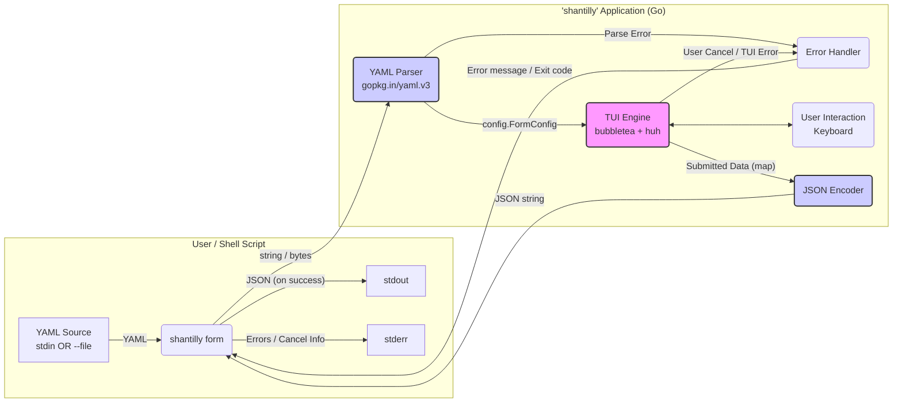

# High Level Architecture

## Technical Summary

The `shantilly` architecture is a **Monolithic CLI Application**, written in Go (v1.24.2+) and distributed as a single static binary. It operates as a terminal pipeline application, adhering to a strictly linear, declarative data flow: `YAML (stdin/--file) -> TUI -> JSON (stdout)`. `spf13/cobra` manages the CLI command structure, while `gopkg.in/yaml.v3` parses the input. `charmbracelet/bubbletea` (based on The Elm Architecture) manages the TUI state, and `charmbracelet/huh` is used to dynamically render form components based on the parsed YAML configuration. `charmbracelet/lipgloss` will provide basic styling and layout. Error conditions result in messages on `stderr` and non-zero exit codes.

## High Level Overview

Based on the PRD requirements:

1. **Architectural Style:** Monolithic CLI Application. The application executes, processes input, and terminates. No network services or data persistence are within the MVP scope.
2. **Repository Structure:** Simple Go Monorepo (`cmd/` and `internal/`), based on the user-provided template.
3. **Service Architecture:** N/A (Monolithic).
4. **Primary Data Flow:**
    * A shell script executes `shantilly form` piping YAML to `stdin` OR using `--file path/to/form.yaml`.
    * The `cobra` command reads input (stdin or file).
    * The `Parser (gopkg.in/yaml.v3)` decodes the YAML into internal Go structs.
    * The `TUI Engine (bubbletea + huh)` receives these structs, dynamically builds a `huh.Form`, and renders the interactive TUI.
    * The user interacts with the TUI (managed by the `bubbletea` event loop).
    * Upon successful submission, the TUI collects data into Go structs/maps.
    * The `JSON Encoder` serializes the output data to `stdout`.
    * Any errors (e.g., YAML parse failure, user cancellation) are reported to `stderr` with non-zero exit codes (NFR8).
5. **Wizard Implementation:** Multi-step forms (wizards) are orchestrated by the *calling shell script*, which chains multiple `shantilly form` executions, passing data between steps via script logic. `shantilly` itself remains stateless for each invocation.
6. **Dynamic YAML Data:** Populating YAML templates with dynamic data (e.g., variables) is the responsibility of the *calling shell script* (using tools like `envsubst`, `sed`, `jq`, etc.) *before* passing the final YAML to `shantilly`.

## High Level Project Diagram

## Architectural and Design Patterns

* **Command Line Interface (CLI):** Managed by `spf13/cobra` for command structure, flags (`--file`), and stdin reading.
* **Pipeline / Filter:** Acts as a classic Unix filter: reads data, transforms it (via user interaction), writes data.
* **Declarative UI:** The core pattern. UI is defined in YAML, not hardcoded.
* **The Elm Architecture (TEA):** Used by `charmbracelet/bubbletea` to manage TUI state via `Model -> Update -> View`. The `huh.Form` will be embedded within the `bubbletea` Model.
* **Modular Monolith (Internal):** Code organized into Go packages (`internal/config`, `internal/tui`, `internal/util`) for separation of concerns and testability.
