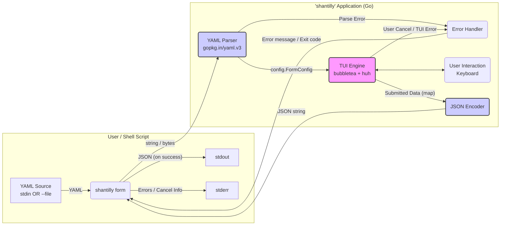
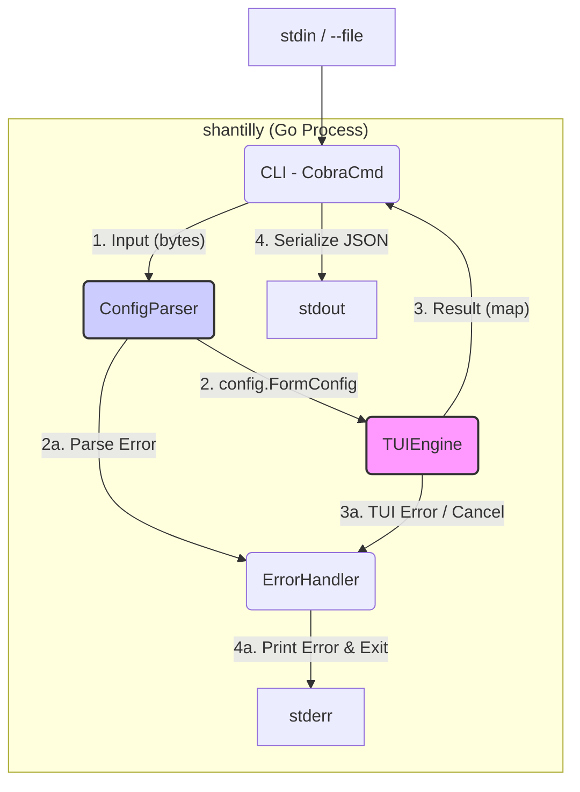

# shantilly Architecture Document

## Introduction

This document outlines the overall technical architecture for the `shantilly` project. Its primary goal is to serve as the guiding architectural blueprint for AI-driven development, ensuring consistency and adherence to chosen patterns and technologies.

`shantilly` is a monolithic Command Line Interface (CLI) application, written in Go. It operates as a terminal pipeline: receiving a TUI definition in YAML format via `stdin` or `--file`, rendering an interactive TUI (using `charmbracelet/bubbletea` and `charmbracelet/huh`), collecting user input, and upon submission, emitting the collected data as a structured JSON object to `stdout`.

This document focuses on the backend/CLI systems and non-web UI concerns.

### Starter Template or Existing Project

N/A. This is a greenfield project that will not be based on a starter template. The structure will be built from scratch, following standard Go conventions and utilizing the core libraries identified in the PRD (Go, `spf13/cobra`, `charmbracelet/bubbletea`, `charmbracelet/huh`, `charmbracelet/lipgloss`, `gopkg.in/yaml.v3`) and the user-provided project template files.

### Change Log

| Date       | Version | Description                                          | Author              |
| :--------- | :------ | :--------------------------------------------------- | :------------------ |
| 2025-10-23 | 0.1.0   | Initial draft based on PRD v0.2.0.                   | Winston (Architect) |
| 2025-10-23 | 0.2.0   | Incorporated user template files and decisions.      | Winston (Architect) |
| 2025-10-23 | 0.2.1   | Added `--file` input, cancel workflow, wizard logic. | Winston (Architect) |
| 2025-10-23 | 0.3.0   | Added Checklist Results and Next Steps sections.     | Winston (Architect) |

## High Level Architecture

### Technical Summary

The `shantilly` architecture is a **Monolithic CLI Application**, written in Go (v1.24.2+) and distributed as a single static binary. It operates as a terminal pipeline application, adhering to a strictly linear, declarative data flow: `YAML (stdin/--file) -> TUI -> JSON (stdout)`. `spf13/cobra` manages the CLI command structure, while `gopkg.in/yaml.v3` parses the input. `charmbracelet/bubbletea` (based on The Elm Architecture) manages the TUI state, and `charmbracelet/huh` is used to dynamically render form components based on the parsed YAML configuration. `charmbracelet/lipgloss` will provide basic styling and layout. Error conditions result in messages on `stderr` and non-zero exit codes.

### High Level Overview

Based on the PRD requirements:

1. **Architectural Style:** Monolithic CLI Application. The application executes, processes input, and terminates. No network services or data persistence are within the MVP scope.
2. **Repository Structure:** Simple Go Monorepo (`cmd/` and `internal/`), based on the user-provided template.
3. **Service Architecture:** N/A (Monolithic).
4. **Primary Data Flow:**
    * A shell script executes `shantilly form` piping YAML to `stdin` OR using `--file path/to/form.yaml`.
    * The `cobra` command reads input (stdin or file).
    * The `Parser (gopkg.in/yaml.v3)` decodes the YAML into internal Go structs.
    * The `TUI Engine (bubbletea + huh)` receives these structs, dynamically builds a `huh.Form`, and renders the interactive TUI.
    * The user interacts with the TUI (managed by the `bubbletea` event loop).
    * Upon successful submission, the TUI collects data into Go structs/maps.
    * The `JSON Encoder` serializes the output data to `stdout`.
    * Any errors (e.g., YAML parse failure, user cancellation) are reported to `stderr` with non-zero exit codes (NFR8).
5. **Wizard Implementation:** Multi-step forms (wizards) are orchestrated by the *calling shell script*, which chains multiple `shantilly form` executions, passing data between steps via script logic. `shantilly` itself remains stateless for each invocation.
6. **Dynamic YAML Data:** Populating YAML templates with dynamic data (e.g., variables) is the responsibility of the *calling shell script* (using tools like `envsubst`, `sed`, `jq`, etc.) *before* passing the final YAML to `shantilly`.

### High Level Project Diagram



### Architectural and Design Patterns

* **Command Line Interface (CLI):** Managed by `spf13/cobra` for command structure, flags (`--file`), and stdin reading.
* **Pipeline / Filter:** Acts as a classic Unix filter: reads data, transforms it (via user interaction), writes data.
* **Declarative UI:** The core pattern. UI is defined in YAML, not hardcoded.
* **The Elm Architecture (TEA):** Used by `charmbracelet/bubbletea` to manage TUI state via `Model -> Update -> View`. The `huh.Form` will be embedded within the `bubbletea` Model.
* **Modular Monolith (Internal):** Code organized into Go packages (`internal/config`, `internal/tui`, `internal/util`) for separation of concerns and testability.

## Tech Stack

### Build and Distribution Infrastructure

* **Build Platform:** GitHub Actions.
* **Key Services:**
  * `golangci-lint` (for code linting, configured via `.golangci.yml`).
  * `GoReleaser` (for build automation, cross-compilation, packaging, configured via `.goreleaser.yaml`).
* **Deployment Target (Distribution):** GitHub Releases.
* **Regions:** N/A (global binary distribution).

### Technology Stack Table

This table is the single source of truth for project dependencies. Versions are based on the user-provided template and current stable releases (as of late 2025).

| Category           | Technology                | Version | Purpose                                     | Rationale                                                                   |
| :----------------- | :------------------------ | :------ | :------------------------------------------ | :-------------------------------------------------------------------------- |
| **Language**       | Go                        | 1.24.2+ | Primary development language                | Requirement (NFR3), User Template (`go.mod`). Modern, fast, static builds.  |
| **CLI Framework**  | `spf13/cobra`             | v1.8.x  | Core CLI structure (commands, flags, stdin) | Requirement (FR1). Go standard.                                             |
| **TUI Engine**     | `charmbracelet/bubbletea` | v0.26.x | TUI state management (TEA)                  | Requirement (FR4), User Template (`go.mod`). Powerful, flexible.            |
| **TUI Components** | `charmbracelet/huh`       | v0.4.x  | Declarative TUI form generation             | Requirement (FR3). Drastically simplifies form creation.                    |
| **TUI Styling**    | `charmbracelet/lipgloss`  | v0.11.x | Terminal styling (colors, layout)           | Requirement (FR7), User Template (`go.mod`). Needed for alignment.          |
| **YAML Parsing**   | `gopkg.in/yaml.v3`        | v3.0.x  | Decoding `stdin`/file YAML to Go structs    | Requirement (Story 1.2). Robust and widely used.                            |
| **Testing**        | `testing` (Go Stdlib)     | 1.24.2+ | Unit testing (MVP focus)                    | Go standard (PRD Tech Assumptions).                                         |
| **Linter**         | `golangci-lint`           | v1.59.x | Static analysis, code quality               | Best practice. User Template (`.golangci.yml`, `.pre-commit-config.yaml`).  |
| **Formatter**      | `gofumpt`                 | latest  | Strict code formatting                      | Best practice. User Template (`.pre-commit-config.yaml`, `lint.sh`).        |
| **Build/Release**  | `GoReleaser`              | v1.26.x | Build automation, cross-compilation (NFR2)  | Best practice. User Template (`.goreleaser.yaml`). Simplifies distribution. |
| **Pre-commit**     | `pre-commit` framework    | latest  | Local quality checks before commit          | Best practice. User Template (`.pre-commit-config.yaml`).                   |

## Data Models

### FormConfig (Input - YAML)

**Purpose:** Represents the YAML structure read from `stdin` or `--file`. Defines the form to be rendered. Used by `gopkg.in/yaml.v3` for unmarshalling.

**Key Attributes (Go Structs):**

```go
// Location: internal/config/models.go

package config

// FormConfig is the root structure parsed from YAML.
type FormConfig struct {
 Title  string        `yaml:"title,omitempty"` // Optional title (PRD).
 Fields []FieldConfig `yaml:"fields"`          // Required list of fields (PRD).
}

// FieldConfig defines a single form field (component).
type FieldConfig struct {
 // --- Required Attributes (MVP) ---
 Key   string `yaml:"key"`   // Unique ID for JSON output (FR6).
 Label string `yaml:"label"` // Display text in TUI.
 Type  string `yaml:"type"`  // Maps to 'huh' component (FR3).
                           // Expected: "input", "textarea", "select", "multiselect", "confirm", "note"

 // --- Optional Attributes (Based on PRD examples) ---
 Placeholder string   `yaml:"placeholder,omitempty"` // Hint text for input/textarea.
 Value       string   `yaml:"value,omitempty"`       // Default value.
 Options     []string `yaml:"options,omitempty"`     // Choices for select/multiselect.
 Limit       int      `yaml:"limit,omitempty"`       // Max selections for multiselect (0=unlimited).
 Affirmative string   `yaml:"affirmative,omitempty"` // "Yes" text for confirm.
 Negative    string   `yaml:"negative,omitempty"`    // "No" text for confirm.
 Detail      string   `yaml:"detail,omitempty"`      // Body text for note.
}
```

**Relationships:**

* A `FormConfig` HAS MANY `FieldConfig`.

### FormData (Output - JSON)

**Purpose:** Represents the data collected from the user upon successful form submission. Will be serialized to `stdout` (FR6).

**Key Attributes (Go Type):**

* As keys are user-defined in YAML (`key`), this is not a static Go struct.
* The Go type used for collection and serialization will be: `map[string]interface{}`
* The `string` key is the `key` from `FieldConfig`, and the `interface{}` value is the user input (`string`, `[]string`, or `bool`).

**Relationships:**

* This map is the final output of the `huh.Form` interaction, generated from `FormConfig`.

## Components

### Component List

**`CLI (CobraCmd)`**

* **Responsibility:** Entry point (`cmd/shantilly/main.go`). Manages `form` command (`spf13/cobra`), reads input (stdin/file), invokes `ConfigParser` and `TUIEngine`, directs results/errors to `stdout`/`stderr`.
* **Key Interfaces:** `formCmd.RunE(cmd *cobra.Command, args []string) error`
* **Dependencies:** `ConfigParser`, `TUIEngine`, `ErrorHandler`.
* **Technology:** `spf13/cobra`.

**`ConfigParser`**

* **Responsibility:** (`internal/config`). Decodes input YAML into `config.FormConfig` structs. Performs initial validation (e.g., known `Type`).
* **Key Interfaces:** `func Parse(data []byte) (*config.FormConfig, error)`
* **Dependencies:** `gopkg.in/yaml.v3`, `config.FormConfig`.
* **Technology:** `gopkg.in/yaml.v3`.

**`TUIEngine`**

* **Responsibility:** (`internal/tui`). Core interactive component. Receives `config.FormConfig`. Dynamically builds `huh.Form` by mapping `FieldConfig` to `huh` components. Wraps the form in a `bubbletea.Model` to manage TUI state and lifecycle.
* **Key Interfaces:** `func Run(config *config.FormConfig) (map[string]interface{}, error)`
* **Dependencies:** `bubbletea`, `huh`, `lipgloss`, `config.FormConfig`.
* **Technology:** `charmbracelet/bubbletea`, `charmbracelet/huh`, `charmbracelet/lipgloss`.

**`ErrorHandler`**

* **Responsibility:** Utility (`internal/util`). Centralizes error handling (NFR8). Formats errors, writes to `stderr`, exits with non-zero status.
* **Key Interfaces:** `func Handle(err error)` (Updated based on implementation example).
* **Dependencies:** `os`, `fmt`, `errors`, `bubbletea`.
* **Technology:** Go Standard Library, `bubbletea`.

### Component Diagram (Internal Control Flow)



## External APIs

**N/A:** Not applicable for the MVP. `shantilly` is a self-contained local CLI application and does not interact with external network APIs (NFR1, NFR5).

## Core Workflows

### Workflow 1: Successful Submission (Happy Path)

Illustrates FR2, FR4, FR6.

```mermaid
sequenceDiagram
    actor User
    participant Shell
    participant CLI(shantilly form)
    participant ConfigParser
    participant TUIEngine(bubbletea + huh)
    participant JSONEncoder

    User->>Shell: Executes script (e.g., shantilly form --file form.yaml)
    Shell->>CLI(shantilly form): 1. Reads YAML (file or stdin)

    activate CLI
    CLI->>ConfigParser: 2. Parse(yaml bytes)
    activate ConfigParser
    ConfigParser-->>CLI(shantilly form): 3. Returns *config.FormConfig
    deactivate ConfigParser

    CLI->>TUIEngine(bubbletea + huh): 4. Run(config)
    activate TUIEngine
    TUIEngine->>User: 5. Renders interactive TUI

    User->>TUIEngine(bubbletea + huh): 6. Fills form
    User->>TUIEngine(bubbletea + huh): 7. Submits form

    TUIEngine-->>CLI(shantilly form): 8. Returns data (map[string]interface{})
    deactivate TUIEngine

    CLI->>JSONEncoder: 9. Encode(data)
    activate JSONEncoder
    JSONEncoder-->>CLI(shantilly form): 10. Returns JSON string
    deactivate JSONEncoder

    CLI->>Shell: 11. Writes JSON string to stdout
    deactivate CLI
    Shell->>User: Displays JSON output
```

### Workflow 2: YAML Parse Error (Error Path)

Illustrates NFR8.

```mermaid
sequenceDiagram
    actor User
    participant Shell
    participant CLI(shantilly form)
    participant ConfigParser
    participant ErrorHandler

    User->>Shell: Executes script (e.g., shantilly form --file bad_form.yaml)
    Shell->>CLI(shantilly form): 1. Reads invalid YAML

    activate CLI
    CLI->>ConfigParser: 2. Parse(yaml bytes)
    activate ConfigParser
    ConfigParser-->>CLI(shantilly form): 3. Returns error (e.g., malformed YAML)
    deactivate ConfigParser

    CLI->>ErrorHandler: 4. Handle(error)
    activate ErrorHandler
    ErrorHandler->>Shell: 5. Writes error message to stderr
    ErrorHandler->>CLI(shantilly form): 6. Signals exit(1) via os.Exit()
    deactivate ErrorHandler

    deactivate CLI # Already exited
    Shell->>User: Displays error message
```

### Workflow 3: User Cancellation (Abort Path - NFR8)

Illustrates NFR8 requirement for clean exit on Esc/Ctrl+C.

```mermaid
sequenceDiagram
    participant User
    participant CLI(shantilly form)
    participant TUIEngine(bubbletea + huh)
    participant ErrorHandler

    User->>CLI(shantilly form): 1. Starts TUI
    activate CLI
    CLI->>TUIEngine(bubbletea + huh): 2. Run(config)
    activate TUIEngine
    TUIEngine->>User: 3. Renders TUI

    User->>TUIEngine(bubbletea + huh): 4. Presses 'Esc' or 'Ctrl+C'

    TUIEngine-->>CLI(shantilly form): 5. Returns error (e.g., bubbletea.QuitMsg or ErrAborted)
    deactivate TUIEngine

    CLI->>ErrorHandler: 6. Handle(ErrAborted or QuitMsg)
    activate ErrorHandler
    ErrorHandler->>Shell: 7. Optionally writes "Cancelled" to stderr
    ErrorHandler->>CLI(shantilly form): 8. Signals exit(2) via os.Exit()
    deactivate ErrorHandler

    deactivate CLI # Already exited
    User->>User: (Terminal is clean, NO JSON output)
```

## REST API Spec

**N/A:** Not applicable for the MVP. `shantilly` does not expose or consume a REST API.

## Database Schema

**N/A:** Not applicable for the MVP. `shantilly` does not use a database.

## Source Tree

Based on standard Go project layout and the user-provided template.

```plaintext
shantilly/                     # Project Root (replace with actual name later)
├── .github/
│   └── workflows/
│       └── release.yml        # GitHub Actions pipeline for GoReleaser
├── .golangci.yml              # Linter configuration (from template)
├── .goreleaser.yaml           # GoReleaser configuration (from template, needs project_name update)
├── .pre-commit-config.yaml    # Pre-commit hooks (from template)
├── .gitignore                 # Git ignore rules (from template)
├── cmd/
│   └── shantilly/             # Main application package
│       └── main.go            # Entry point: Cobra setup, CLI logic, stdin/file reading
├── internal/
│   ├── config/                # Configuration parsing and validation
│   │   ├── models.go        # Go structs (FormConfig, FieldConfig)
│   │   ├── parser.go        # ConfigParser component (YAML parsing logic)
│   │   └── parser_test.go   # Unit tests for parser
│   ├── tui/                   # TUI rendering and interaction logic
│   │   ├── engine.go        # TUIEngine component (Bubbletea model)
│   │   └── mapper.go        # Logic to map config.FieldConfig -> huh components
│   └── util/                  # Shared utility functions
│       └── errorhandler.go    # ErrorHandler component (stderr output, exit codes)
├── examples/                  # Example YAML form definitions for testing/docs
│   └── basic_form.yaml
├── Makefile                   # Build, Lint, Test scripts (integrates lint.sh logic)
├── go.mod                     # Go module definition (from template, adjusted)
├── go.sum                     # Go module checksums
├── lint.sh                    # Local linting script (from template)
├── LICENSE                    # Project License (MIT from template)
└── README.md                  # Project README (from template, needs customization)

```

## Infrastructure and Deployment

### Infrastructure as Code (IaC)

* **Tool:** `GoReleaser` (`.goreleaser.yaml` from template).
* **Location:** `.goreleaser.yaml` (root directory).
* **Approach:** Defines declarative build, cross-compilation, packaging, and release process.

### Deployment Strategy (Release)

* **Strategy:** GitHub Releases.
* **CI/CD Platform:** GitHub Actions (Tech Stack).
* **Pipeline Configuration:** `.github/workflows/release.yml`.

### Environments

* **N/A:** Not applicable for a CLI. Target environments are user machines (Linux, macOS, Windows - NFR2).

### Promotion Flow (Release)

```mermaid
graph TD
    A[Dev: Push to 'main'] --> B(CI: Run 'golangci-lint' & 'go test')
    B -- Success --> C[Dev: Create Git Tag (e.g., 'v1.0.0')]
    C --> D[Dev: Push Tag to GitHub]
    D -- Trigger (on tag) --> E[GitHub Actions: Run 'goreleaser release']

    subgraph "GoReleaser (in CI)"
        direction TB
        F(1. Static Compile<br/>CGO_ENABLED=0)
        F --> G(2. Cross-Compile<br/>NFR2 Targets)
        G --> H(3. Create Checksums)
        H --> I(4. Package Archives<br/>.zip / .tar.gz)
    end

    E --> F
    I --> J[GitHub Actions: Publish GitHub Release 'v1.0.0' with binaries]

    style J fill:#bbf,stroke:#333,stroke-width:2px
```

### Rollback Strategy

* **Method:** Delete problematic GitHub Release, publish new patch release (e.g., `v1.0.1`) with fix.
* **Triggers:** Critical bug reports from users.

## Error Handling Strategy

### General Approach

* **Model:** Standard Go `error` interface.
* **Propagation:** Errors propagated up the call stack to `CLI`.
* **Centralized Handling:** `CLI` catches errors, passes to `ErrorHandler`.
* **Output Separation:** `stdout` for success JSON (FR6), `stderr` for errors/status (NFR8).
* **Exit Codes:** Non-zero exit codes for errors and cancellations defined in `internal/util`.

### Error Handling Patterns

#### YAML Parse Errors (`ConfigParser`)

* **Detection:** `gopkg.in/yaml.v3` errors.
* **Output:** Formatted message (incl. line number if possible) to `stderr`.
* **Exit Code:** `util.ExitError` (e.g., 1).
* **Workflow:** See "Workflow 2: YAML Parse Error".

#### TUI Cancellation (`TUIEngine`)

* **Detection:** `bubbletea.QuitMsg` or specific `util.ErrAborted`.
* **Output:** No `stdout`. Optional "Cancelled" message to `stderr`.
* **Exit Code:** `util.ExitCancelled` (e.g., 2).
* **Workflow:** See "Workflow 3: User Cancellation".

#### Unexpected TUI Errors (`TUIEngine`)

* **Detection:** Internal `bubbletea`/`huh` errors.
* **Output:** Detailed error message (maybe stack trace) to `stderr`.
* **Exit Code:** `util.ExitError` (e.g., 1).

#### Other Errors (e.g., JSON Encoding)

* **Detection:** Standard library errors.
* **Output:** Error message to `stderr`.
* **Exit Code:** `util.ExitError` (e.g., 1).

### Implementation (`ErrorHandler`)

Located in `internal/util/errorhandler.go`. Provides `Handle(err error)`.

```go
package util

import (
 "errors" // Import errors package
 "fmt"
 "os"

 tea "[github.com/charmbracelet/bubbletea](https://github.com/charmbracelet/bubbletea)" // Import bubbletea
)

// Exit codes for clarity
const (
 ExitOK        = 0
 ExitError     = 1 // General error
 ExitCancelled = 2 // User cancellation
)

// Define a specific error for cancellation if bubbletea.QuitMsg isn't enough context
var ErrAborted = errors.New("operation aborted by user")

// Handle prints the error (if not nil) to stderr and exits with the code.
// It assumes successful exit (code 0) if err is nil.
func Handle(err error) {
 if err == nil {
  os.Exit(ExitOK) // Success path
 }

 exitCode := ExitError // Default to general error

 // Check for specific error types or messages
 // Check if it's our specific abort error OR if it's the standard bubbletea Quit message
 if errors.Is(err, ErrAborted) || errors.As(err, &tea.QuitMsg{}) {
  exitCode = ExitCancelled
  // Optionally print a message to stderr for cancellation
  // fmt.Fprintln(os.Stderr, "Operation cancelled.") // Keep it silent for better script integration
 } else {
  // Print actual error for non-cancellation cases
  fmt.Fprintf(os.Stderr, "Error: %v\n", err)
  // TODO: Add more sophisticated error type checking and formatting here
  // e.g., check for YAML parsing errors and provide line numbers if possible from yaml.v3.
 }

 os.Exit(exitCode)
}
```

## Coding Standards

Defined primarily by the user-provided template files. Adherence is mandatory and checked automatically.

### Core Standards

* **Language & Runtime:** Go `1.24.2+` (per template `go.mod`).
* **Style & Linting:** Governed by `.golangci.yml` (per template). Checked via `golangci-lint run ./...` and pre-commit hooks.
* **Formatting:** Governed by `gofumpt`. Checked via `gofumpt -w .` and pre-commit hooks.
* **Test Organization:** `_test.go` files in the same package (Go standard).

### Naming Conventions

* Standard Go conventions (`camelCase`, `PascalCase`). Enforced by `stylecheck` linter in `.golangci.yml`.

### Critical Rules (from `.golangci.yml`)

1. **Error Handling (`errcheck`, `errorlint`, `wrapcheck`):** Check/wrap all errors. Use `errors.Is/As`.
2. **No Unused Code (`unused`, `ineffassign`):** Remove dead code.
3. **Simplicity (`gocyclo`, `funlen`, `nestif`):** Keep functions short, low complexity.
4. **Performance (`prealloc`, `gocritic`):** Pre-allocate slices, follow `gocritic` advice.
5. **No Magic Numbers (`mnd`):** Use named constants.
6. **Full Struct Init (`exhaustivestruct`):** Initialize all struct fields explicitly.

### Language-Specific Guidelines (Go)

* Follow "Effective Go".
* Use pointers judiciously.
* Prefer small interfaces.

## Test Strategy and Standards

### Testing Philosophy

* **Approach:** Test-After for MVP. Focus on unit tests first. Manual TUI testing.
* **Coverage Goals:** No strict % target for MVP, but high coverage (\>80%) for `internal/config`.
* **Test Pyramid (MVP):** Heavy on Unit Tests, complemented by Manual TUI tests.

### Test Types and Organization

#### Unit Tests

* **Framework:** Go `testing` package (v1.24.2+).
* **File Convention:** `_test.go` in the same package.
* **Location:** Primarily `internal/config/`.
* **Mocking:** No external dependencies to mock in MVP. Use interfaces for potential future manual fakes/stubs if needed between internal components.
* **AI Agent Requirements:** Generate comprehensive tests for `internal/config/parser.go`, covering valid/invalid YAML cases. Follow AAA pattern.

#### Integration Tests

* **N/A:** Out of scope for MVP.

#### E2E Tests

* **N/A:** Out of scope for MVP. Manual testing covers this.

### Test Data Management

* **Strategy:** Example `.yaml` files in `examples/` directory act as fixtures for `ConfigParser` tests.

### Continuous Testing

* **CI Integration:** GitHub Actions runs `go test ./...` (via `lint.sh` or build workflow).
* **Local Testing:** Developers use `./lint.sh` (from template) which includes `go test -v -race ./...`.
* **Performance/Security Tests:** N/A for MVP.

## Security

### Input Validation

* **Focus:** YAML input via `stdin` or `--file`.
* **Location:** `ConfigParser` (`internal/config/parser.go`).
* **Required Rules:**
  * Validate `FieldConfig.Type` against known `huh` component types (e.g., "input", "textarea", "select", "multiselect", "confirm", "note"). Reject invalid types via `ErrorHandler` (NFR8).
  * Handle malformed YAML gracefully via `ErrorHandler` (NFR8).

### AuthN / AuthZ / Secrets / API Security / Data Protection

* **N/A:** Not applicable for MVP (local CLI, no network, no sensitive data persistence).

### Dependency Security

* **Scanning Tool:** `govulncheck`.
* **Update Policy:** Review/update dependencies regularly (e.g., via Dependabot).
* **Approval Process:** Evaluate new dependencies before adding.

### Security Testing

* **SAST:** `gosec` (integrated via `golangci-lint` in `.golangci.yml`).
* **DAST / Pentest:** N/A for MVP.

## Checklist Results Report

### Architect Solution Validation Checklist (`architect-checklist.md`) Execution Summary

* **Project Type:** Greenfield CLI/TUI (Backend Only focus for checklist)
* **Overall Architecture Readiness:** High
* **Critical Risks Identified:** 0
* **Key Strengths:** Clear alignment with PRD, leveraging standard Go practices and user-provided template, well-defined error handling, robust build/release process via GoReleaser.
* **Sections Evaluated:** All sections except those marked `[[FRONTEND ONLY]]`.

#### Section Analysis (Summary)

* **1. Requirements Alignment**
  * Status: ✅ PASS
  * Notes: Architecture directly maps to PRD requirements (FR/NFR).

* **2. Architecture Fundamentals**
  * Status: ✅ PASS
  * Notes: Clear diagrams, modular internal design, standard patterns used.

* **3. Technical Stack & Decisions**
  * Status: ✅ PASS
  * Notes: Stack defined, versions specified, aligned with user template.

* **4. Frontend Design (Skipped)**
  * Status: N/A
  * Notes: Project is CLI/TUI only.

* **5. Resilience & Operational**
  * Status: ✅ PASS
  * Notes: Error handling defined, deployment via GoReleaser is robust.

* **6. Security & Compliance**
  * Status: ✅ PASS
  * Notes: Minimal surface area addressed (input validation, dep scanning).

* **7. Implementation Guidance**
  * Status: ✅ PASS
  * Notes: Coding standards via `.golangci.yml`, Source Tree defined.

* **8. Dependency & Integration Mgmt**
  * Status: ✅ PASS
  * Notes: Dependencies managed via `go.mod`, no external runtime integrations.

* **9. AI Agent Implementation Suitability**
  * Status: ✅ PASS
  * Notes: Modular design, clear standards, template use aids AI consistency.

* **10. Accessibility (Skipped)**
  * Status: N/A
  * Notes: TUI accessibility handled by underlying libraries (Charm).

#### Risk Assessment

* No critical risks identified in the architecture itself.
* Potential implementation risks (low):
  * Complexity in `TUIEngine` mapping `config.FormConfig` to `huh.Form` dynamically. Mitigation: Clear `mapper.go` component, unit tests for edge cases if possible.
  * Ensuring correct error propagation and exit codes for all scenarios in `ErrorHandler`. Mitigation: Specific unit tests for `ErrorHandler`, manual testing of error paths.

#### Recommendations

* **Must-fix:** None.
* **Should-fix:** None identified at architecture level.
* **Nice-to-have:** Consider adding specific examples in `examples/` for each supported `FieldConfig.Type`.

#### AI Implementation Readiness

* **High.** The architecture is modular, uses standard Go patterns, relies on template files for tooling setup (`.golangci.yml`, `.goreleaser.yaml`), and provides clear separation of concerns. The `README.md` from the template gives direct instructions to AI agents.

#### Final Verdict

The architecture is sound, complete for the MVP scope, well-aligned with the PRD and user-provided template, and ready for development.

## Next Steps

### Handoff Prompt for Developer Agent

**To:** Dev Agent 👨‍💻
**From:** Winston (Architect) 🏗️
**Subject:** Implement Shantilly MVP - Story 1.1 (CLI Foundation)

**Context:**
The architecture for the `shantilly` CLI (MVP) is finalized and validated (see `docs/architecture.md`). This project uses Go (1.24.2+) and the Charmbracelet ecosystem (`bubbletea`, `huh`, `lipgloss`) along with `cobra` and `yaml.v3`. We are adopting the user-provided project template files (`.golangci.yml`, `.goreleaser.yaml`, `go.mod`, etc.) for tooling and standards.

**Goal:**
Implement Story 1.1 from the PRD (`prd.md`) - "CLI Foundation and Project Structure".

**Key Architectural Guidance (from `docs/architecture.md`):**

* **Source Tree:** Follow the defined structure, place main logic in `cmd/shantilly/main.go`.
* **Tech Stack:** Use `spf13/cobra` (v1.8.x).
* **Components:** Implement the basic `CLI (CobraCmd)` component.
* **Coding Standards:** Adhere strictly to `.golangci.yml` rules. Use `gofumpt` for formatting. Ensure `./lint.sh` passes before marking complete.

**Tasks (derived from Story 1.1 ACs):**

1. Initialize the Go module structure as defined in the `Source Tree` section (if not already present from the template). Ensure `go.mod` reflects the project name and Go version.
2. Implement the root `shantilly` command using `spf13/cobra` in `cmd/shantilly/main.go`.
3. Add the `form` subcommand to the root command (also in `main.go`). Define the `--file` string flag for it.
4. Implement the `RunE` (or `Run`) function for the `form` subcommand:
      * Check if the `--file` flag was provided.
          * If yes, read the content of the specified file. Handle file read errors.
          * If no, read all bytes from `os.Stdin`. Handle potential stdin read errors.
      * Propagate any read errors up to be handled by the `ErrorHandler`.
      * *(For this story only)*: Print a placeholder message like "Form executed. Read X bytes." to `os.Stdout`.
      * Return `nil` on success.
5. Ensure the `ErrorHandler` (`internal/util/errorhandler.go`) is implemented as defined in the architecture doc (handling `nil` error, printing non-nil errors to `stderr`, using `os.Exit` with defined codes). Update `main.go`'s `RunE` to call `util.Handle(err)` appropriately on error return.
6. Create/Update the `Makefile` with a basic `build` target: `go build -o shantilly ./cmd/shantilly`. Add `lint` (`./lint.sh`) and `test` (`go test -v -race ./...`) targets.
7. Ensure the code passes `make lint` and `make test` (though no specific tests for this story yet).

**Acceptance Criteria (from Story 1.1):**

* [AC1] Go repo initialized (`cmd/`, `internal/`).
* [AC2] `spf13/cobra` used.
* [AC3] `shantilly` root and `form` subcommand exist.
* [AC4] `shantilly form` reads `stdin` OR uses `--file` flag.
* [AC5] `shantilly form` prints placeholder to `stdout` on success.
* [AC6] `Makefile` includes `build`, `lint`, `test` targets.
* (Implicit) Errors during input reading lead to `stderr` message and non-zero exit code via `ErrorHandler`.

**Definition of Done:**

* All tasks completed.
* All ACs met.
* Code is formatted (`gofumpt`).
* Linter passes (`make lint`).
* Build succeeds (`make build`).
* Provide the complete content for `cmd/shantilly/main.go` and `internal/util/errorhandler.go`. List any other created/modified files (like `Makefile`).
