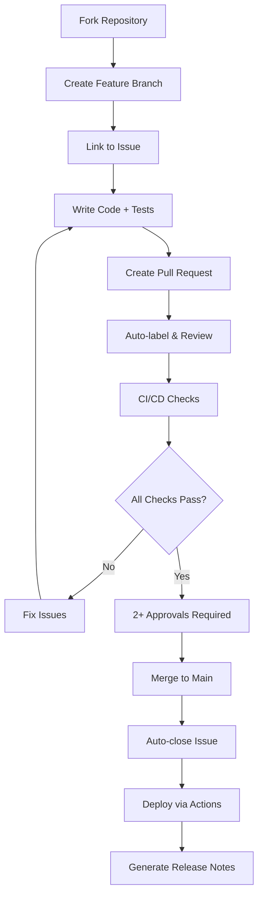

# GitHub Workflow - Shantilly Project

## 🔄 Fluxo Completo de Desenvolvimento



## 🤖 Colaboração Híbrida: Humanos + IA

### Para Humanos

```bash
# Clone e setup
git clone https://github.com/helton-godoy/shantilly.git
cd shantilly
git checkout -b feat/issue-123-description

# Padrões de nomenclatura
feat/issue-123-new-feature
fix/issue-456-bug-fix
refactor/issue-789-cleanup
docs/issue-101-update-docs
```

### Para Agentes IA

- **GitHub App Integration**: @dependabot, @github-actions
- **API Endpoints**: createIssue, updateProject, assignReviewer
- **Bot Commands**: Auto-PR creation, issue linking

## 📊 Automação com GitHub Actions

### Workflows Principais

1. **CI/CD Pipeline**: Build, Test, Security Scan
2. **Auto-labeling**: Baseado em conteúdo
3. **Weekly Reports**: Progresso e métricas
4. **Dependabot**: Auto-updates
5. **Pages Deploy**: Documentação automática

## 🎯 Métricas e KPIs

- **Velocity**: Issues fechadas/semana
- **PR Turnaround**: Tempo médio de merge
- **Coverage**: Test coverage automático
- **Security**: Vulnerabilidades detectadas
- **Adoção**: Stars, forks, contributors
